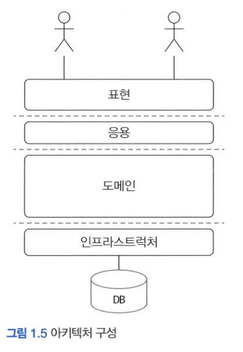

# 1️⃣ 도메인 모델 시작하기

# 🌀 도메인

## 🍥 도메인이란?

- **소프트웨어로 해결하고자 하는 문제 영역** ex) 온라인 서점
- 한 도메인은 다시 하위 도메인으로 나눌 수 있음


- 한 하위 도메인은 다른 하위 도메인과 연동하여 완전한 기능을 제공
    - 고객이 물건을 구매하면 주문,결제, 배송, 혜택 하위 도메인의 기능이 엮임
- 특정 도메인을 위한 소프트웨어라고 해서 도메인이 제공해야 할 모든 기능을 직접 구현하는 것은 아님.
    - 일부기능은 자체 시스템으로 구현하고, 나머지 기능은 외부 업체의 시스템 사용

  

- 도메인 마다 고정된 하위 도메인이 존재하는 것은 아님.
    - 하위 도메인을 어떻게 구성할지는 상황에 따라 달라짐.
- 이해관계자와 개발자 모두 도메인 지식을 갖춰야 함
    - 제품 개발과 관련된 도메인 전문가, 관계자, 개발자가 같은 지식을 공유하고 직접 소통할수록 도메인 전문가가 원하는 제품을 만들 가능성이 높아짐

# 🌀 도메인 모델

## 🍥 도메인 모델이란?

- 기본적으로 도메인 모델은 특정 도메인을 개념적으로 표현한 것.
- 도메인 자체를 이해하기 위한 개념 모델
    - 개념 모델을 이용해 바로 코드를 작성할 수 있는 것은 아니기에 구현 기술에 맞는 구현 모델이 따로 필요

  

  객체 기반 주문 도메인 모델

    - 주문(Order)은 주문번호(orderNumber)와 지불할 총금액(totalAmounts)이 있고, 배송정보(ShippingInfo)를 변경(changeShipping)할 수 있음 알수 있고, 주문을 취소(cancel) 할 수있다는 것도 알 수있음.
    - 도메인 모델을 사용하면 여러 관계자들이 동일한 모습으로 도메인을 이해하고 도메인 지식을 공유하는데 도움이 됨
- 도메인 모델을 객체,상태 다이어그램등 다양하게 모델링 가능
    - 객체 모델은 도메인이 제공하는 기능과 도메인의 주요 데이터 구성을 파악하는데 용이
    - 상태 다이어그램 모델은 도메인의 상태 변경을 파악하는데 용이

      

      상태 다이어그램을 이용한 주문 상태 모델링

- 도메인 모델을 표현 할 때 클래스 다이어그램이나 상태 다이어그램 같은 UML 표기법만 사용해야하는 것은 아님
    - 관계가 중요한 도메인이라면 그래프를 이용해 도메인 모델링 가능
    - 계산 규칙이 중요하다면 수학 공식을 활용해 도메인 모델링 가능

- 도메인은 다수의 하위 도메인으로 구성되기 떄문에 각 하위 도메인이 다루는 영역은 서로 다르기 때문에 같은 용어라도 하위 도메인마다 의미가 달라질 수 있음.
    - 💡 도메인에 따라 용어 의미가 결정되므로 여러 하위 도메인을 하나의 다이어그램에 모델링 하면 안됨.
    - 모델의 각 구성요소는 특정 도메인으로 한정할 때 비로소 의미가 완전해지기 떄문에 각 하위 도메인마다 별도로 모델을 만들어야 함.

## 🍥 도메인 모델 패턴

- 애플리케이션 아키텍쳐

  

  

- 도메인 모델 패턴 은 아키텍쳐 상의 도메인 계층을 객체 지향 기법으로 구현하는 패턴
- 도메인 계층은 도메인의 핵심 규칙을 구현
- 핵심 규칙을 구현한 코드는 도메인 모델에만 위치하기 떄문에 규칙이 바뀌거나 확정되야 할때 다른 코드에 영향을 덜 주고 변경 내역을 모델에 반영할 수 있게됨

<aside>
💡

개념모델과 구현모델

개념모델은 순수하게 문제를 분석한 결과물

데이터베이스, 트랜잭션 처리, 성능, 구현 기술과 같은 것들을 고려하고 있지않아 구현 가능한 형태의 모델로 전환하는 과정이 필요

</aside>

## 🍥 도메인 모델 도출

- 도메인을 모델링할 때 기본이 되는 작업은 모델을 구성하는 핵심 구성요소, 규칙 기능을 찾는 것.
    - 이 과정은 요구사항에서 출발

- 주문 도메인과 관련된 몇가지 요구사항을 예시로 봐보자
    - 최소 한 종류 이상의 상품을 주문해야 한다.
    - 한 상품을 한개 이상 주문할 수 있다.
    - 총 주문 금액은 각 상품의 구매 가격 합을 모두 더한 금액이다.
    - 각 상품의 구매 가격 합은 상품 가격에 구매 개수를 곱한 값이다.
    - 주문할 때 배송지 정보를 반드시 지정해야 한다.
    - 배송지 정보는 받는 사람 이름, 전화번호, 주소로 구성된다.
    - 출고를 하면 배송지를 변경할 수 없다.
    - 출고 전에 주문을 취소할 수 있다.
    - 고객이 결제를 완료하기 전에는 상품을 준비하지 않는다.

- 이 요구사항에서 알 수 있는 것은 주문은 **출고 상태로 변경하기**, **배송지 정보 변경하기, 주문 취소하기, 결제 완료하기** 기능을 제공한다는 것.
    - 상세 구현까지는 아니지만 Order에 관련 기능을 메서드로 추가 가능

    ```java
    public class Order {
    public void changeShipped() {..}
    public void changeShippingInfo(ShippingInfo newShipping) {...}
    public void cancel() {.. }
    public void completePayment() {.. }
    }
    ```


- 다음 요구사항들은 주문 항목이 어떤 데이터로 구성되는지 알려줌
    - 한 상품을 한개 이상 주문할 수 있다.
    - 총 주문 금액은 각 상품의 구매 가격 합을 모두 더한 금액이다.
- 두 요구사항에 따르면 주문 항목을 표현하는 OrderLine은 적어도 주문할 상품, 상품의 가격, 구매 개수를 포함해야 함. 추가로 각 구매 항목의 구매 가격도 제공해야함
    - OrderLine은 한 상품(product)을 얼마에(price) 몇 개 살지(quantity)를 담고 있고 calculateAmounts() 메서드로 구매가격을 구하는 로직을 구현

    ```java
    public class OrderLine {
    	private Product product;
    	private int price;
    	private int quantity;
    	private int amounts;
    	
    	public OrderLine(Product product, int price, int quantity) {
    		this.product = product;
    		this.price = price;
    		this.quantity = quantity;
    		this.amounts = calculateAmounts();
    	}
    	
    	private int calculateAmounts() {
    		return price * quantity;
    	}
    	...
    }
    ```


- 다음 요구사항은 Order와 OrderLine의 관계를 알려줌
    - 최소 한 종류 이상의 상품을 주문해야 한다.
    - 총 주문 금액은 각 상품의 구매 가격 합을 모두 더한 금액이다.

```java
public class Order {
	private List<OrderLine> orderLines;
	private Money totalAmounts;
	
	public Order(List<OrderLine > orderLines) {
		setOrderLines(orderLines);
	}
	
	private void setOrderLines(List<OrderLine > orderLines) {
		verifyAtLeastOne0rMore0rderLines(orderLines);
		this.orderLines = orderLines;
		calculateTotalAmounts();
	}
	
	private void verifyAtLeastOneOrMoreOrderLines(List<OrderLine> orderLines) {
		if (orderLines == null || orderLines.isEmpty()) {
		throw new IllegalArgumentException("no OrderLine");
		}
	}
	
	private void calculateTotalAmounts() {
	int sum = orderLines.stream()
            .mapToInt (x -> x.getAmounts())
            .sum();
	this.totalAmounts = new Money(sum);
	}
}
```

- Order는 한 개 이상의 OrderLine을 가질 수 있으므로 Order를 생성할떄 OrderLine목록을 List로 전달
- 생성자에서 호출하는 setOrderLines() 메서드로 요구사항에 정의한 제약조건 검사
- 최소 한 종류 이상의 상품을 주문해야하므로verifyAtLeastOne0rMore0rderLines() 메서드로 OrderLine이 한 개 이상 존재하는지 검사
- calculateTotalAmounts() 메서드로 총 주문 금액 계산

- 배송지 정보는 이름, 전화번호, 주소 데이터를 가지므로 ShippingInfo 클래스를 다음과 같이 정의 가능

    ```java
    public class ShippingInfo {
    	private String receiverName;
    	private String receiverPhoneNumber;
    	private String shippingAddress1;
    	private String shippingAddress2;
    	private String shippingZipcode;
    	
    	... 생성자,getter
    }
    ```


- 주문할 때 배송지 정보를 반드시 지정해야 한다.라는 요구사항을 지키기위해 Order를 생성할 때 ShippingInfo도 추가

    ```java
    public class Order {
    	private List<OrderLine> orderLines;
    	private ShippingInfo shippingInfo;
    	...
    	
    	public Order(List<OrderLine > orderLines, ShippingInfo shippingInfo) {
    		setOrderLines(orderLines);
    		setShippingInfo(shippingInfo);
    	}
    	
    	private void setShippingInfo(ShippingInfo shippingInfo) {
    		if (shippingInfo == null)
    			throw new IllegalArgumentException("no ShippingInfo");
    		this.shippingInfo = shippingInfo;
    	}
    	...
    }
    ```

- setShippingInfo() ShippingInfo가 null이면 익셉션이 발생하는데, 이렇게 함으로써 베송지 정보 필수라는 도메인 규칙 구현

- 도메인을 구현하다 보면 특정 조건인 상태에 따라 제약이나 규칙이 다르게 적용되는 경우가 많음
- 아래와 같은 요구사항들이 제약과 규칙,상태를 표현하고 있음
    - 출고를 하면 배송지를 변경할 수 없다.
    - 출고 전에 주문을 취소할 수 있다.
    - 고객이 결제를 완료하기 전에는 상품을 준비하지 않는다.
- 다른 요구사항들을 확인해서 추가로 존재할 수있는 상태를 분석한 뒤, 열거 타입을 이용해 상태정보 표현 가능

    ```java
    public enum OrderState {
    	PAYMENT_WAITING, PREPARING, SHIPPED, DELIVERING, DELIVERY_COMPLETED,
    	CANCELED;
    }
    ```

- 배송지 변경이나 주문 취소 기능이 출고 전에만 가능하다는 제약 규칙을 적용하기위해 Order 클래스를 수정
    - changeShippingInfo()와 cancel()은 verifyNotYetShipped()메서드를 먼저 실행

    ```java
    public class Order {
    	private OrderState state;
    	
    	public void changeShippingInfo(ShippingInfo newShippingInfo) {
    		verifyNotYetShipped();
    		setShippingInfo(newShippingInfo);
    	}
    	
    	public void cancel() {
    		verifyNotYetShipped();
    		this.state = OrderState.CANCELED;
    	}
    	
    	private void verifyNotYetShipped() {
    		if (state != OrderState.PAYMENT WAITING && state != OrderState.PREPARING)
    			throw new IllegalStateException("aleady shipped");
    	}
    	...
    }
    ```


# 🌀 앤티티와 밸류

- 도출한 모델은 크게 엔티티(Entity)와 밸류(Value)로 구분 가능

## 🍥 엔티티

- 엔티티의 가장 큰 특징은 식별자를 가지는 것.
- 식별자는 엔티티 객체마다 고유해서 각 엔티티는 서로 다른 식별자를 갖는다


Order는 엔티티로서 orderNumber를 식별자로 가짐

- 엔티티의 식별자는 바뀌지 않음
    - 엔티티를 생성하고 속성을 바꾸고 삭제할 때까지 식별자는 유지됨
- 엔티티의 식별자는 바뀌지않고 고유하기 때문에 두 엔티티 객체의 식별자가 같으면 두 엔티티는 같다고 판단 가능
- 엔티티를 구현한 클래스는 식별자를 이용해 equals()와 hashCode() 구현 가능

    ```java
    public class Order {
    	private String orderNumber;
    	
    	@Override 
    	public boolean equals(Object obj) {
    		if (this == obj) return true;
    		if (obj== null) return false;
    		if (obj.getClass0 != Order.class) return false;
    		Order other = (Order)obj;
    		if (this.orderNumber = = null) return false;
    		return this.orderNumber.equals(other.orderNumber);
    	}
    	
    	@Override
    	public int hashCode() {
    		final int prime = 31;
    		int result = 1;
    		result = prime * result + ((orderNumber == null) ? 0 : orderNumber .hashCode);
    		return result;
    }
    ```


### 🍧 엔티티의 식별자 생성

- 엔티티의 식별자를 생성하는 시점은 도메인의 특징과 사용하는 기술에 다름.
  흔히 다음 중 한가지 방식으로 생성됨
    - 특정 규칙에 따라 생성
        - 흔히 사용하는 규칙은 현재 시간과 다른 값을 함께 조합
        - 주의할 점은 같은 시간에 동시에 식별자를 생성해도 같은 식별자가 만들어지면 안됨
    - UUID나 Nano ID와 같은 고유 식별자 생성기 사용
        - 다수의 개발 언어가 UUID 생성기 제공
        - 자바는 java.util.UUID 클래스를 사용해서 생성 가능

        ```java
        UUID uuid = UUID.randomUUID();
        
        //613f2sd-c3212-4sfds9sd-2313-ds1233과 같은 형식 문자열
        String strUuid = uuid.toString0;
        ```

    - 값을 직접 입력
        - 회원의 아이디나 이메일과 같은 식별자는 값을 직접 입력
        - 사용자가 직접 입력하는 값이기 때문에 식별자를 중복해서 입력하지 않도록 사전에 방지하는 것이 중요
    - 일련번호 사용( 시퀀스나 DB의 자동 증가 칼럼 사용)
        - 주로 데이터베이스가 제공하는 자동 증가 기능 사용
        - 자동 증가 칼럼은 DB 테이블에 데이터를 삽입해야 값을 알 수 있기 떄문에 테이블에 데이터를 추가하기 전에는 식별자를 알 기가 불가능

        ```java
        Article article = new Article(author, title, ...);
        articleRepository.save(article); // DB에 저장한 뒤 구한 식별자를 엔티티에 반영
        Long savedArticleId = article.getId(); //DB에 저장한 후 식별자 참조 가능
        ```


## 🍥 밸류 타입

- 밸류 타입은 개념적으로 완전한 하나를 표현할 때 사용

    ```java
    public class Receiver {
    	private String name;
    	private String phoneNumber;
    	
    	public Receiver(String name, String phoneNumber) {
    		this.name = name;
    		this.phoneNumber= phoneNumber;
    	}
    	
    	public String getName() {
    		return name;
    	}
    	
    	public String getPhoneNumber() {
    		return phoneNumber;
    	}
    }
    ```

    - 예를 들어, Receiver는 ‘받는 사람’ 이라는 도메인 개념을 표현
- 밸류 타입이 꼭 두 개 이상의 데이터를 가져야 하는 것은 아님.
    - 의미를 명확하게 표현하기 위해 밸류 타입을 사용하는 경우도 존재

    ```java
    public class OrderLine {
    	private Product product;
    	private int price;
    	private int quantity;
    	private int amounts;
    	...
    ```

    - OrderLine의 price와 amounts는 int 타입의 숫자를 사용하고 있지만 “돈”을 의미하는 값들.
    - 돈을 의미하는 Money 타입을 만들어 사용하면 코드를 이해하는데 도움

    ```java
    public class Money {
    	private int value;
    	
    	public Money(int value) {
    		this.value = value;
    	}
    	
    	public int getValue() {
    		return this.value;
    	}
    }
    ```

    ```java
    public class OrderLine {
    	private Product product;
    	private Money price;
    	private int quantity;
    	private Money amounts;
    ...
    ```

- 밸류 타입의 장점은 밸류타입을 위한 기능을 추가 가능
- 밸류 객체의 데이터를 변경할 때는 기존 데이터를 변경하기보다는 변경한 데이터를 갖는 새로운 밸류 객체를 생성하는 방식 선호
    - 데이터 변경 기능을 제공하지 않는 타입을 **불변**이라고 표현
    - 밸류 타입을 불변으로 구현하면 안전한 코드를 작성하는 것이 가능
        - 불변 타입이 아닐경우 밸류 타입을 생성할때 생성자로 받은 파라미터의 값이 변경될 수 있기 때문에 데이터를 복사한 새로운 객체를 생성해야 함

    ```java
    public class Money {
    	private int value;
    	
    	... 생성자, getValue()
    	
    	public Money add (Money money) {
    		return new Money(this.value + money.value);
    	}
    	
    	public Money multiply(int multiplier) (
    	return new Money(value * multiplier);
    	}
    }
    ```

    - Money 타입은 돈 계산을 위한 기능을 추가 가능
    - add 메서드는 Money를 새로 생성

### 🍧 엔티티 식별자와 밸류 타입

- 엔티티 식별자의 실제 데이터는 String과 같은 문자열로 구성된 경우가 많음
- 밸류 타입의 식별자는 단순한 문자열이 아니라 도메인에서 특별한 의미를 지니는 경우가 많기 때문에 식별자를 위한 밸류 타입을 사용해 의미가 잘 드러나도록 함.
    - 예를 들어 주문번호를 표현하기 위해 Order의 식별자 타입으로 String 대신 OrderNo 밸류 타입을 사용하면 타입을 통해 해당 필드가 주문번호임을 식별 가능.

    ```java
    public class Order {
    	//OrderNo 타입 자체로 id가 주문번호임을 알 수 있다.
    	private OrderNo id;
    	...
    	public OrderNo getId() {
    		return id;
        }
    }
    ```


### 🍧 도메인 모델에 set 메서드 넣지 않기

- 도메인 모델에 get/set 메서드를 무조건 추가하는 것은 좋지 않음.
- 특히 set 메서드는 도메인의 핵심 개념이나 의도를 코드에서 사라지게 함.
    - set 메서드는 필드값만 변경하고 상태 변경과 관련된 도메인 지식이 코드에서 사라지게 됨
- set 메서드를 사용하면 도메인 객체를 생성할 때 온전하지 않은 상태가 될 수 있음.

    ```java
    // set 메서드로 데이터를 전달하도록 구현하면
    // 처음 Order를 생성하는 시점에 order는 완전하지 않다.
    Order order = new Order; 
    // set 메서드로 필요한 모든 값을 전달해야 함.
    order.setOrderLine(lines);
    order.setShippingInfo(shippingInfo);
    // 주문자(Orderer)를 설정하지 않은 상태에서 주문 완료 처리
    order.setState(OrderState.PREPARING);
    ```

    - 도메인 객체가 불완전한 상태로 사용되는 것을 막으려면 생성 시점에 필요한 것을 전달 해야함.
      즉, 생성자를 통해 필요한 데이터를 모두 받아야 함

    ```java
    Order order = new Order(orderer, lines, shippingInfo, OrderState.PREPARING);
    ```

    - 생성자로 필요한 것을 모두 받기 때문에 생성자를 호출하는 시점에 필요한 데이터가 올바른지 검증 가능
    - 접근 범위가 set 메서드와 다르게 private이기 떄문에 외부에서 데이터를 변경할 목적으로 사용할 수 없음
- set 메서드를 구현해야할 특별할 이유가 없다면 불변 타입의 장접을 살릴 수 있도록 밸류 타입은 불변으로 구현

# 🌀 도메인 용어

- 코드를 작성할 때 도메인에서 사용하는 용어는 매우 중요
- 도메인에서 사용하는 용어를 코드에 반영하지 않으면 그 코드들은 개발자에게 코드의 의미를 해석해야 하는 부담을 줌

    ```java
    public OrderState {
    	STEP1, STEP2, STEP3, STEPA, STEPS, STEP6
    }
    ```

    ```java
    public enum OrderState {
    	PAYMENT_WAITING, PREPARING, SHIPPED, DELIVERING, DELIVERY_COMPLETED;
    }
    ```

    - 도메인 용어를 사용해  OrderState를 구현하면 도메인 지식을 코드로 해석할 필요가 없음
- 시간이 지날수록 도메인에 대한 이해가 높아지는데 새롭게 이해한 내용을 잘 표현할 수 있는 용어를 찾아내고 이를 다시 공통의 언어로 만들어 다같이 사용.
    - 새로 발견한 용어는 코드나 문서에도 반영해 산출물에 최신 모델 적용
- 국내 개발자는 도메인 용어를 선택하는데 영어라는 불리한 점이 존재
    - 알맞은 영단어를 찾는 것은 쉽지 않은 일이지만 시간을 들여 찾는 노력을 해야함
    - 적당한 단어를 찾는 노력을 하지 않고 도메인에 어울리지 않은 단어를 사용하면 코드는 도메인과 점점 멀어지게됨
    - 도메인 용어에 알맞는 단어를 찾는 시간을 아까워 하지 말자.