# 아키텍처 개요

# 🌀 아키텍쳐

## 🍥 아키텍쳐의 네 가지 영역

- **표현**(또는 UI 영역)
    - 사용자의 요청을 받아 응용 영역에 전달하고 응용 영역의 처리 결과를 다시 사용자에게 보여줌
    - 스프링 MVC 프레임워크가 표현 영역을 위한 기술에 해당

      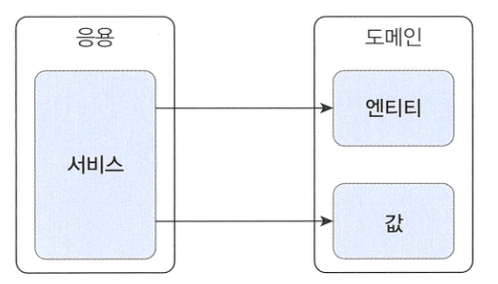

    - 웹 애플리케이션의 표현 영역은 HTTP 요청을 응용 영역이 필요로 하는 형식으로 변환해서 응용 영역에 전달하고 응용 영역의 응답을 HTTP 응답으로 변환하여 전송
- **응용**
    - 표현 영역을 통해 사용자의 요청을 전달받는 응용 영역은 시스템이 사용자에게 제공해야 할 기능을 구현
    - 기능을 구현하기 위해 도메인 영역의 도메인 모델을 사용
    - 응용 서비스는 로직을 직접 수행하기보다는 도메인 모델에 로직 수행을 위임

      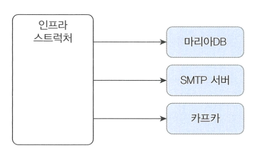
        
- **도메인**
    - 도메인 모델을 구현
    - 도메인 모델은 도메인의 핵심 로직 구현
- **인프라스트럭쳐**
    - 구현 기술에 대한 것을 다룸
    - 논리적인 개념을 표현하기 보다는 실제 구현을 다룸
        
      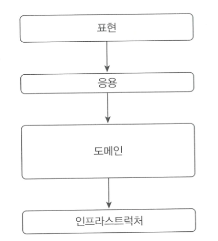

    - 다른 영역에서는 구현 기술을 사용한 코드를 직접 만들지 않음.
    인프라스트럭쳐 영역에서 제공하는 기능을 사용해 다른 영역들이 필요한 기능을 개발
        - 응용 영역에서 DB에 보관된 데이터가 필요하면 인프라스트럭쳐 영역의 DB 모듈을 사용하여 데이터를 읽어들임

## 🍥 계층 구조 아키텍쳐

- 아키텍쳐의 네영역을 구성할 때 계층구조를 따름
    
    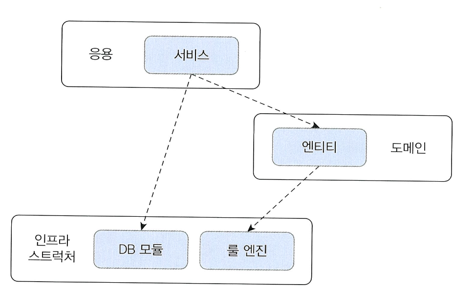
    
- 계층 구조는 그 특성상 사우이 계층으로의 의존만 존재하고 하위 계층은 상위 계층에 의존하지 않음
    - 표현 계층은 응용 계층에 의존하고 응용 계층이 도메인 계층에 의존하지만, 반대로 인프라스트럭쳐 계층이 도메인에 의존하거나 도메인이 응용 계층에 의존하지는 않음
- 계층 구조를 엄격하게 적용한다면 상위 계층은 바로 아래의 계층에만 의존을 가져야 하지만 구현의 편리함을 위해 계층 구조를 유연하게 적용하기도 함
    - 응용 계층은 바로 아래 계층인 도메인 계층에 의존하지만 외부 시스템과의 연동을 위해 더 아래 계층인 인프라스트럭처 계층에 의존하기도 함
        
        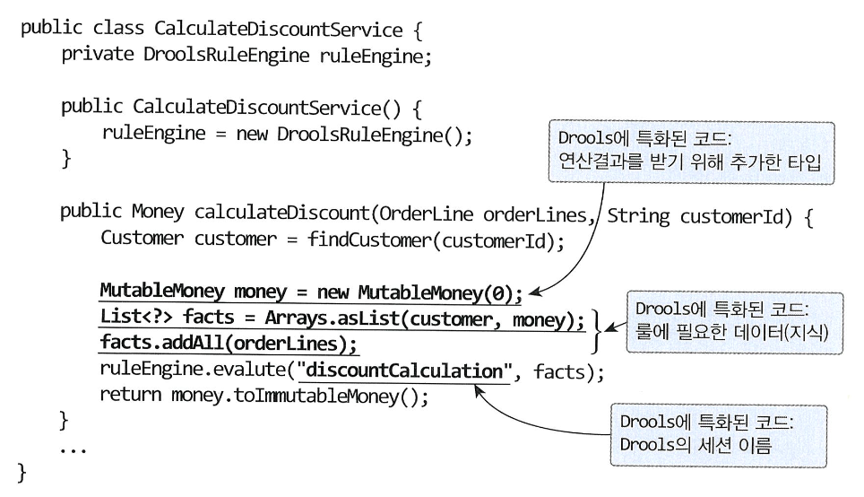
        
        전형적인 계층 구조상의 의존 관계
        
- 표현, 응용, 도메인 계층이 상세한 구현 기술을 다루는 인프라스트럭쳐 계층에 종속됨
    
    ```java
    public class DroolsRuleEngine {
    	private KieContainer Container;
    	
    	public DroolsRuleEngine() {
    		KieServices ks = KieServices.Factory.get();
    		kContainer = ks.getKieClasspathContainer();
    	}
    	
    	public void evalute(String sessionName, List<?> facts) {
    		KieSession Session = kContainer.newKieSession(sessionName);
    		try {
    			facts.forEach(x - kSession.insert(x));
    			kSession.fireAllRules();
    		} finally {
    				kSession.dispose();
    		}
    	}
    }
    ```
    
    ```java
    public class CalculateDiscountService {
    	private DroolsRuleEngine ruleEngine;
    	
    	public CalculateDiscountService {
    		ruleEngine = new DroolsRuleEngine();
    	}
    	
    	public Money calculateDiscount(List <OrderLine> orderLines, String customerid) {
    	Customer customer = findCustomer (customerId);
    	
    	MutableMoney money = new MutableMoney(0);
    	List<?> facts = Arrays.asList(customer, money);
    	facts.addAll(orderLines);
    	ruleEngine.evalute("discountCalculation", facts);
    	return money.toImmutableMoney;
    }
  }
    ```
    
    - 이렇게 되면 **테스트 어려움**, **기능 확장의 어려움** 두가지 문제 발생
    1. CalculateDiscountService만 테스트하기 어려움. 
    RuleEngine 클래스와 관련 설정 파일을 모두 만든 이후에 비로소 CalculateDiscountService가 올바르게 동작하는지 확인 가능
        1. 즉, 응용영역이 인프라스트럭처 영역에 종속되어있어 응용 영역만 테스트하기 어려움
    2. 구현 방식을 변경하는 것이 어려움.
        
        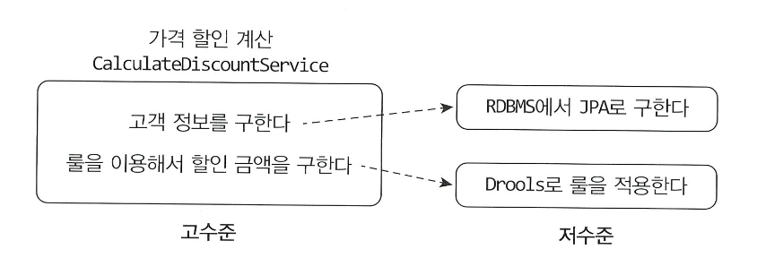
        
        CalculateDiscountService의 코드는 Drools에 간접적인 의존을 가짐
        
        - Drools의 세션이름을 변경하면 CalculateDiscountService의 코드도 함께 변경해야 함.
    - 이 두 문제를 해소하려면 DIP가 필요

# 🌀 DIP

## 🍥 DIP란?

- DIP는 고수준 모듈이 제대로 동작하려면 저수준 모듈을 사용해야하는 문제를 해결하기 위해 저수준 모듈이 고수준 모듈에 의존하도록 바꿈
- 반대로 저수준 모듈이 고수준 모듈에 의존한다고 해서 DIP(Dependency Inversion Principle),의존 역전 원칙이라 부름.
    
    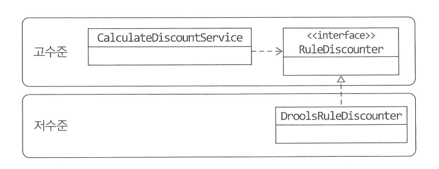
    
    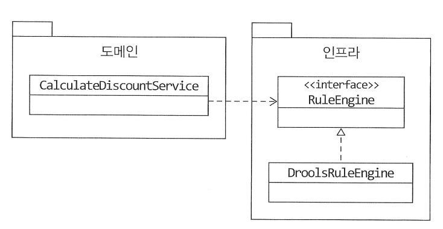
    
    - 추상화 인터페이스를 사용해 문제를 해결
    - CalculateDiscountService는 더 이상 구현 기술인 Drools에 의존하지 않음
        - “룰은 이용한 할인 금액 계산”을 추상화한 RuleDiscounter 인터페이스에 의존

- 구현 기술 교체에 용이
    - 고수준 모듈은 더 이상 저수준 모듈에 의존하지 않고 구현을 추상화한 인터페이스에 의존
    - 실제 사용할 저수준 구현 객체는 의존 주입을 이용해 전달 받음
    
    ```java
    // 사용할 저수준 객체 생성
    RuleDiscounter ruleDiscounter = new DroolsRuleDiscounter();
    // 생성자 방식으로 주입
    CalculateDiscountService disService = new CalculateDiscountService(ruleDiscounter);
    ```
    
    - 구현 기술을 변경하더라도 사용할 저수준 구현 객체를 생성하는 코드만 변경하면 됨
    
    ```java
    // 사용할 저수준 구현 객체 변경
    RuleDiscounter ruleDiscounter = new SimpleRuleDiscounter();
    // 사용할 저수준 모듈을 변경해도 고수준 모듈을 수정할 필요가 없다.
    CalculateDiscountService disService = new CalculateDiscountService(ruleDiscounter);
    ```
    

- 실제 구현 없이 테스트 가능
    
    ```java
    public class CalculateDiscountService {
    	private CustomerRepository customerRepository;
    	private RuleDiscounter ruleDiscounter;
    	...
  }
    ```
    
    - CalculateDiscountService를 테스트하려면 CustomerRepository와 RuleDiscounter를 구현한 객체가 필요.
    - 하지만 DIP를 사용하면 더이상 고수준 모듈이 저수준 모듈을 의존하지 않으므로 저수준 모듈의 객체 생성을 기다려 테스트 할 필요가 없음.
    - 인터페이스의 대역 객체를 사용해 테스트 진행 가능

## 🍥 DIP 주의사항

- DIP를 잘못 생각하면 단순히 인터페이스와 구현 클래스를 분리하는 정도로 받아들일 수 있음.
- DIP를 적용한 결과 구조만보고 저수준 모듈에서 인터페이스를 추출하는 경우가 있음
    
    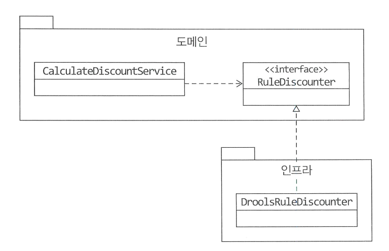
    
- **하지만 DIP의 핵심은 고수준 모듈이 저수준 모듈에 의존하지 않도록 하기 위함.**
- DIP를 적용할 때 하위 기능을 추상화한 인터페이스는 고수준 모듈 관점에서 도출
    - 하위 기능을 추상화한 인터페이스는 고수준 모듈에 위치
    
    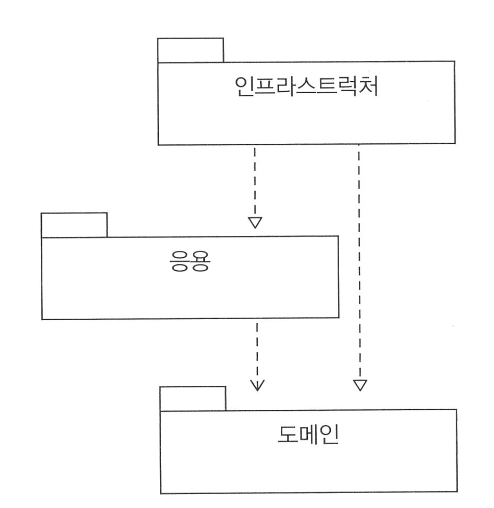
    

## 🍥 DIP와 아키텍쳐

- 인프라스트럭처 영역은 구현 기술을 다루는 저수준 모듈이고 응용 영역과 도메인 영역은 고수준 모듈임.
- 인프라스트럭처 계층이 가장 하단에 위치하는 계층형 구조와 달리 아키텍쳐에 DIP를 적용하면 인프라스트럭쳐 영역이 응용 영역과 도메인 영역에 의존(상속)하는 구조가 됨.

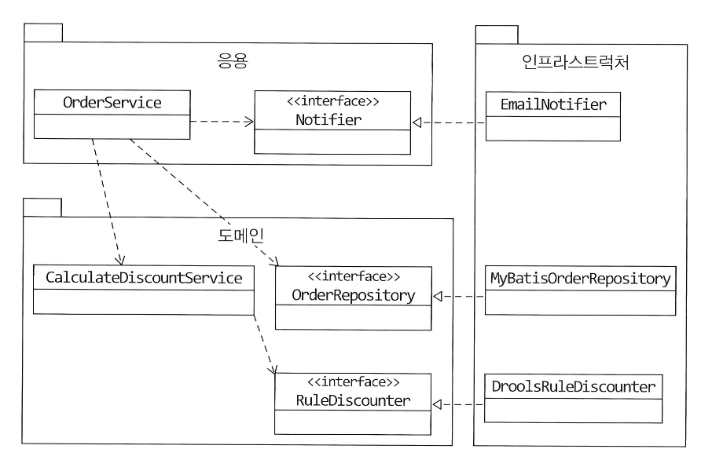

- 인프라스트럭처에 위치한 클래스가 도메인이나 응용 영역에 정의한 인터페이스를 상속받아 구현하는 구조가 되므로 도메인과 응용 영역에 대한 영향을 주지 않거나 최소화하면서 구현 기술을 변경하는 것이 가능

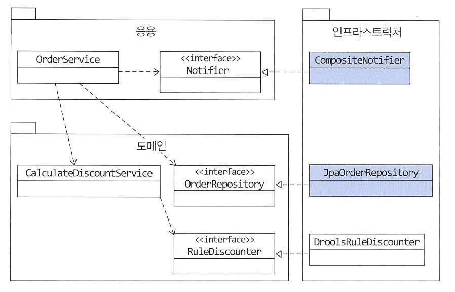

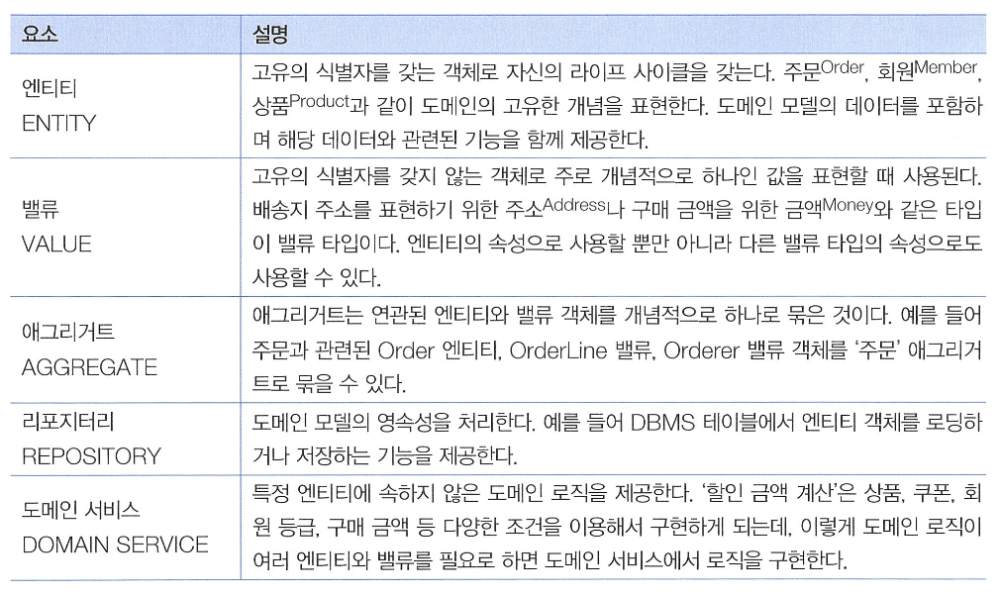

- DIP를 항상 적용할 필요는 없음.
    - 사용하는 구현 기술에 따라 완벽한 DIP를 적용하기보다는 구현 기술에 의존적인 코드를 도메인에 일부 포함하는게 효과적일 때도 있음.
    - 이럴 때는 무조건 DIP를 적용하려고 시도하지 말고 DIP의 이점을 얻는 수준에서 적용 범위를 검토

# 🌀 도메인 영역의 주요 구성요소

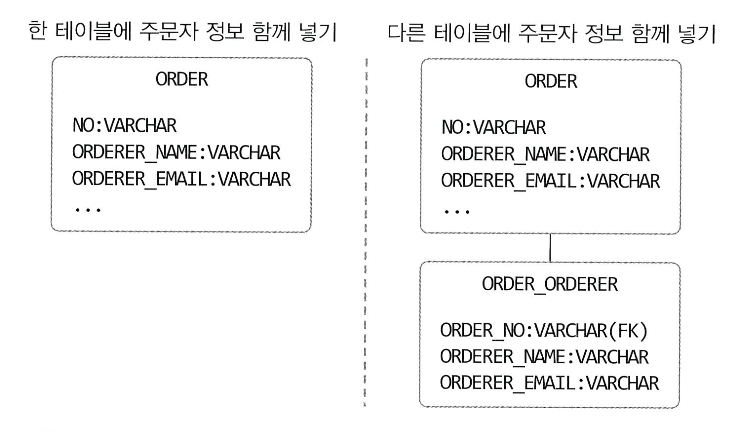

도메인 영역의 주요 구성요소

## 🍥 엔티티와 밸류

- 실제 도메인 모델의 엔티티와 DB 관계형 모델의 엔티티는 같은 것이 아님.
- 도메인 모델의 엔티티는 **데이터와 함께 도메인 기능을 함께 제공**
    - 단순히 데이터를 담고 있는 데이터 구조라기보다는 데이터와 함께 기능을 제공하는 객체
    - 도메인 관점에서 기능을 구현하고 기능 구현을 캡슐화해서 데이터가 임의로 변경되는 것을 막음
    
    ```java
    public class Order {
    	// 주문 도메인 모델의 데이터
    	private OrderNo number;
    	private Orderer orderer;
    	private ShippingInfo shippingInfo;
    	...
    	// 도메인 모델 엔티티는 도메인 기능도 함께 제공
    	public void changeShippingInfo(ShippingInfo newShippingInfo) {
    	...
    	}
    }
    ```
    
- 도메인 모델의 엔티티는 두 개 이상의 데이터가 개념적으로 하나인 경우 밸류 타입을 이용해 표현 가능
    
    ```java
    public class Orderer {
    	private String name;
    	private String email;
    	...
    }
    ```
    
    - RDBMS과 같은 관계형 데이터베이스는 밸류 타입을 제대로 표현하기 힘듦
    
    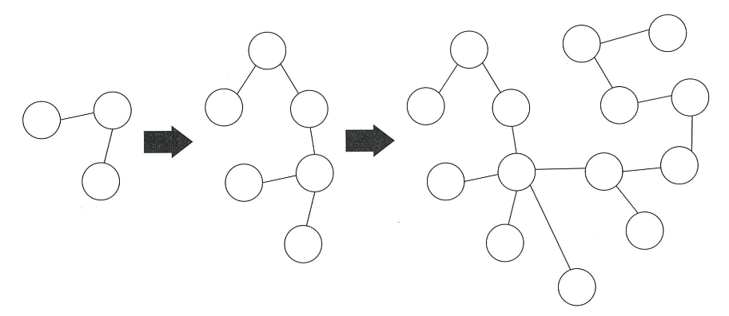
    
    - 왼쪽 그림처럼 Orderer의 개별 데이터를 저장하거나 오른쪽 그림처럼 별도 테이블로 분리해서 저장해야 함.
- 챕터 1에서 설명한 것처럼 밸류는 불변으로 구현할 것을 권장
    - 엔티티의 밸류 타입 데이터를 변경할 때는 객체 자체를 완전히 교체한다는 것을 의미

## 🍥 애그리거트

- 도메인이 커질수록 많은 엔티티와 밸류가 출현, 앤티티와 밸류 개수가 많아질수록 모델은 점점 복잡해짐.

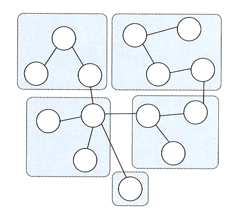

- 도메인 모델이 복잡해지면 개발자가 전체 구조가 아닌 한 개 엔티티와 밸류에만 집중하는 상황이 발생함.
- 이때 상위 수준에서 모델을 관리하지 않고 개별 요소에만 초점을 맞추다 보면, 큰 수준에서 모델을 이해하지 못해 큰 틀에서 모델을 관리할 수 없는 상황에 빠질 수 있음.
- 도메인 모델을 상위 수준에서 볼수 있도록 전체 구조를 이해하는데 도움이 되는 것이 바로 **애그리거트** 임.
- **애그리거트는 관련 객체를 하나로 묶은 군집.**
    - 주문이라는 도메인 개념은 “주문”, “배송지 정보”, “주문자”, “주문 목록”, “총 결제 금액”의 하위 모델로 구성됨
    - 이 하위 개념을 표현한 모델을 하나로 묶어 “주문”이라는 상위 개념으로 표현 가능
    
    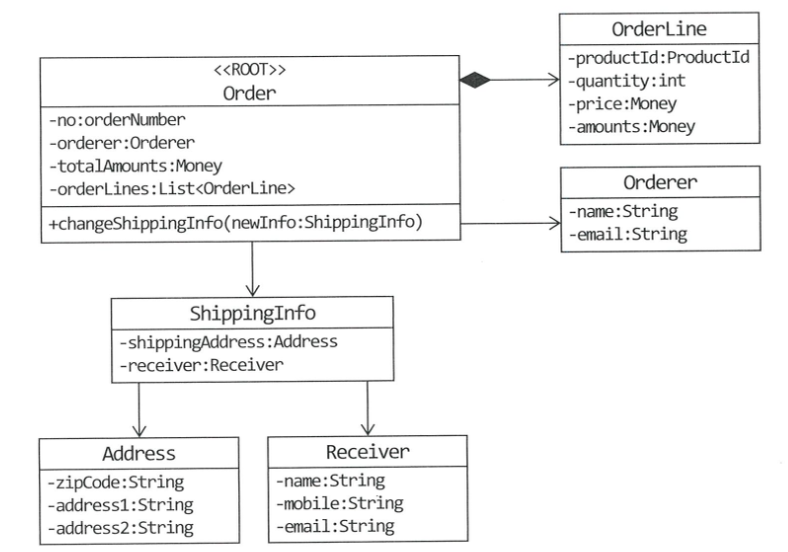
    

- 애그리거트를 사용하면 관련 객체를 묶어 객체 군집 단위로 모델을 바라볼 수 있게됨.
- 개별 객체 간의 관계가 아닌 애그리거트 간의 관계로 도메인 모델을 이해하고 구현하게 되며, 이를 통해 큰 틀에서 도메인 모델을 관리 가능
- 애그리거트는 군집에 속한 객체를 관리하는 루트 엔티티를 가짐.
    - 루트 엔티티는 애그리거트에 속해 있는 엔티티와 밸류 객체를 이용해 애그리거트가 구현해야 할 기능을 제공
- 애그리거트를 사용하는 코드는 애그리거트 루트가 제공하는 기능을 실행하고 애그리거트 루트를 통해 간접적으로 애그리거트 내의 다른 엔티티나 밸류 객체에 접근
    - 애그리거트의 내부 구현을 숨겨서 애그리거트 단위로 구현을 캡슐화할 수 있도록 도움
    
    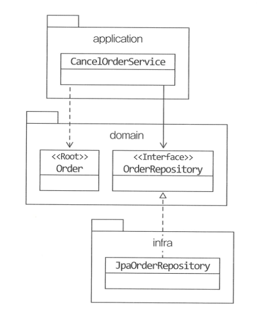
    
    애그리거트 루트인 Order가 애그리거트에 속한 객체를 관리
    
    - 주문 애그리거트는 Order를 통하지 않고 ShippingInfo를 변경할 수 있는 방법을 제공하지 않음
    - 배송지 정보를 변경할 때에는 Order가 구현한 도메인 로직을 항상 따르게 됨

## 🍥 리포지터리

- 도메인 객체를 지속적으로 사용하려면 RDBMS, NoSQL, 로컬 파일과 같은 물리적인 저장소에 도메인 객체를 보관해야함.
- 이를 위한 도메인 모델이 **리포지터리(Repository)**
- 엔티티나 밸류가 요구사항에서 도출되는 도메인 모델이라면 리포지터리는 구현을 위한 도메인 모델
- 리포지터리는 애그리거트 단위로 도메인 객체를 저장하고 조회하는 기능을 정의

```java
public interface OrderRepository {
	Order findByNumber (OrderNumber number);
	void save(Order order);
	void delete(Order order);
}
```

- 도메인 모델을 사용해야 하는 코드는 리포지터리를 통해서 도메인 객체를 구한 뒤에 도메인 객체의 기능을 실행

```java
public class CancelOrderService {
    private OrderRepository orderRepository;

    public void cancel(OrderNumber number) {
        Order order = orderRepository.findByNumber(number);
        if (order == null) throw new NoOrderException(number);
        order.cancel();
    }
}
```

- 도메인 모델 관점에서 OrderRepository는 도메인 객체를 영속화하는 데 필요한 기능을 추상화 한것으로 고수준 모듈에 속함.
- 기반 기술을 이용해서 OrderRepository를 구현한 클래스는 저수준 모듈로 인프라스트럭처 영역에 속함.

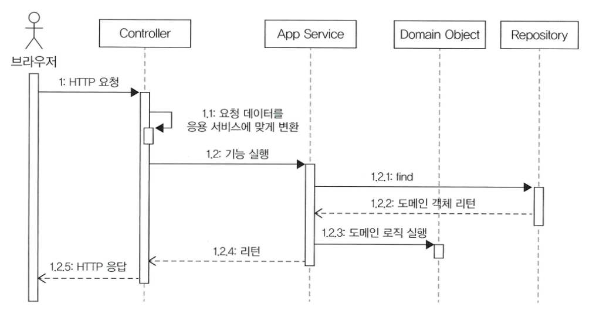

리포지터리 인터페이스는 도메인 모델 영역에 속하며, 실제 구현 클래스는 인프라스트럭처 영역에 속함

- 응용 서비스는 의존 주입과 같은 방식을 사용해서 실제 리포지터리 구현 객체에 접근
    - 응용 서비스는 필요한 도메인 객체를 구하거나 저장할 때 리포지터리를 사용
    - 응용 서비스는 트랜잭션을 관리하는데, 트랜잭션 처리는 리포지터리 구현 기술의 영향을 받음
- 리포지터리는 응용 서비스가 필요로 하는 메서드 제공
    - 애그리거트를 저장하는 메서드
    - 애그리거트 루트 식별자로 애그리거트를 조회하는 메서드
    
    ```java
    public interface SomeRepository {
    	void save(Some some);
    	Some findById(SomeId id);
    	//...등등
    }
    ```
    

## 🍥 요청 처리 흐름

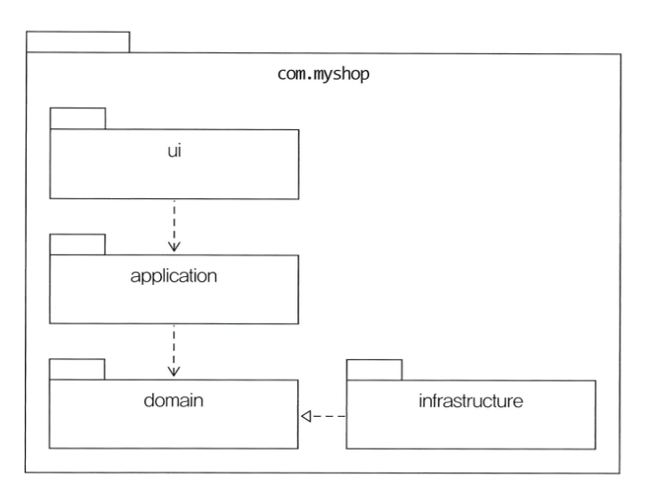

- 응용 서비스는 도메인 모델을 이용해 기능 구현
- 기능 구현에 필요한 도메인 객체를 리포지터리에서 가져와 신규 도메인 객체를 생성해 리포지터리에 저장
- “예매하기”나 “예매 취소”와 같은 기능을 제공하는 응용 서비스는 도메인의 상태를 변경하므로 변경 상태가 물리 저장소에 올바르게 반영되도록 **트랜잭션을 관리** 해야 함.
    - 스프링 프레임워크를 사용하면 스프링에서 제공하는 `@Transactional` 어노테이션을 이용해서 처리 가능

# 🌀 인프라스트럭처

- 인프라스트럭처는 표현 영역, 응용 영역, 도메인 영역을 지원
- 도메인 객체의 영속성 처리, 트랜잭션, STMP 클라이언트, REST 클라이언트 등 다른 영역에서 필요로 하는 프레임워크, 구현 기술, 보조 기능을 지원
- DIP에서 언급한 것처럼 도메인 영역과 응용 영역에 정의한 인터페이스를 인프라스트럭처 영역에서 구현하는 것이 시스템을 더 유연하고 테스트하기 쉽게 만들어줌
- 하지만 무조건 인프라스트럭처에 대한 의존을 없앨 필요는 없음
    - 스프링을 사용할 경우 응용 서비스는 트랜잭션 처리를 위해 스프링이 제공하는 `@Transactional` 사용하는 것이 편리
    - 영속성 처리를 위해 JPA를 사용할 경우 `@Entity`나 `@Table` 과 같은 JPA 전용 어노테이션을 도메인 도멜 클래스에 사용하는 것이 XML 매핑 설정을 이용하는 것보다 편리
- 구현의 편리함은 DIP가 주는 다른 장점만큼 중요하기 때문에 DIP의 장점을 해치지 않는 범위에서 응용 영역과 도메인 영역에서 구현 기술에 대한 의존을 가져가는 것은 나쁘지 않음
- 표현 영역은 항상 인프라스트럭처 영역과 쌍을 이룸.
    - 스프링 MVC를 사용해 웹 요청을 처리하면 스프링이 제공하는 MVC 프레임워크에 맞게 표현 영역을 구현해야 하고, Vert.x를 사용해서 REST API 서버를 구축하려면 Vert.x에 맞게 웹 요청 처리 부분을 구현해야 함.

# 🌀 모듈 구성

- 아키텍처의 각 영역은 별도 패키지에 위치
    - 영역별로 모듈이 위치할 패키지를 구성할 수 있음
    
    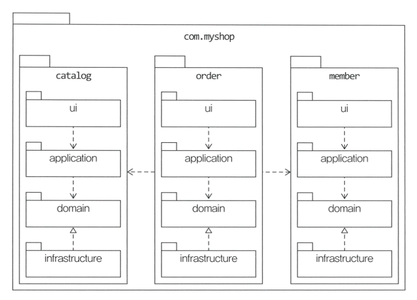
    
    com.myshop은 예시로 든 패키지
    
- 도메인이 크면 하위 도메인으로 나누고 각 하위 도메인마다 별도 패키지를 구성

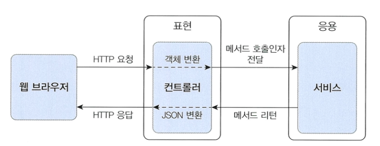

- 애그리거트, 모델, 리포지터리는 같은 패키지에 위치시킴.
    - 주문과 관련된 Order,OrderLine,Orderer,OrderRepository 등은 com.myshop.order.domain 패키지에 위치시킴
    - 도메인이 복잡하면 도메인 모델과 도메인 서비스를 별도 패키지에 위치시킬 수도있음
        - com.myshop.order.domain.order:애그리거트 위치
        - com.myshop.order.domain.service:도메인 서비스 위치
    - 응용 서비스도 도메인 별로 패키지를 구분 가능
        - com.myshop.catalog.application.product
        - com.myshop.catalog.application.category
- 모듈 구조를 얼마나 세분화해야 하는지에 대한 정해진 규칙은 없음.
    - 한 패키지에 너무 많은 타입이 몰려서 (10 ~15개 이상) 코드를 찾을 때 불편하지 않을 정도로만 구분하는 것이 좋음