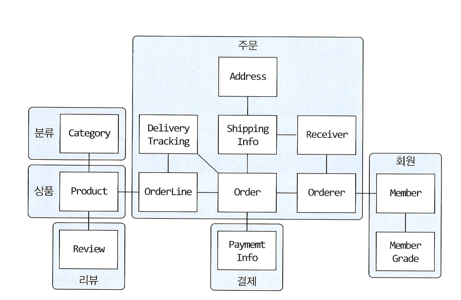
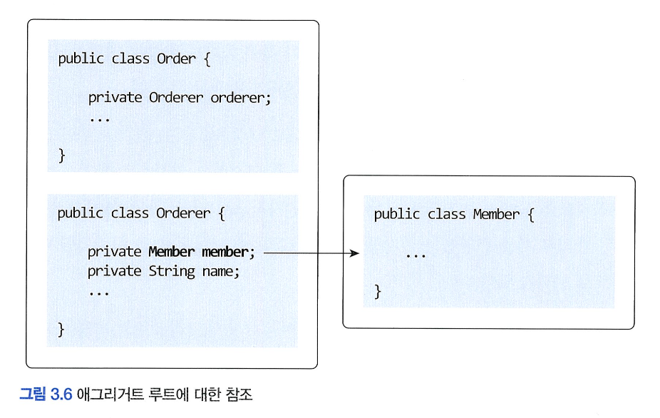
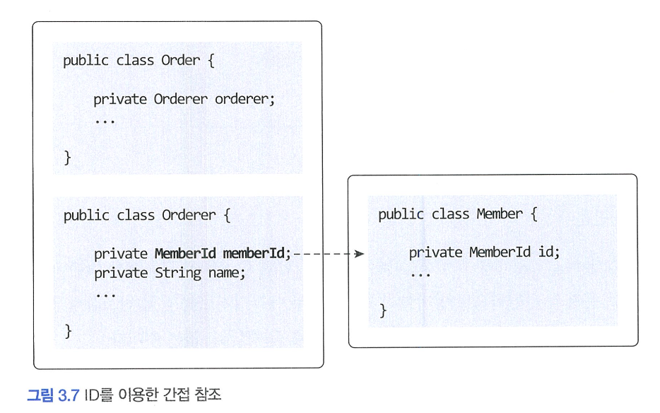
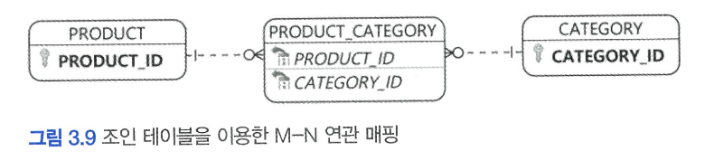
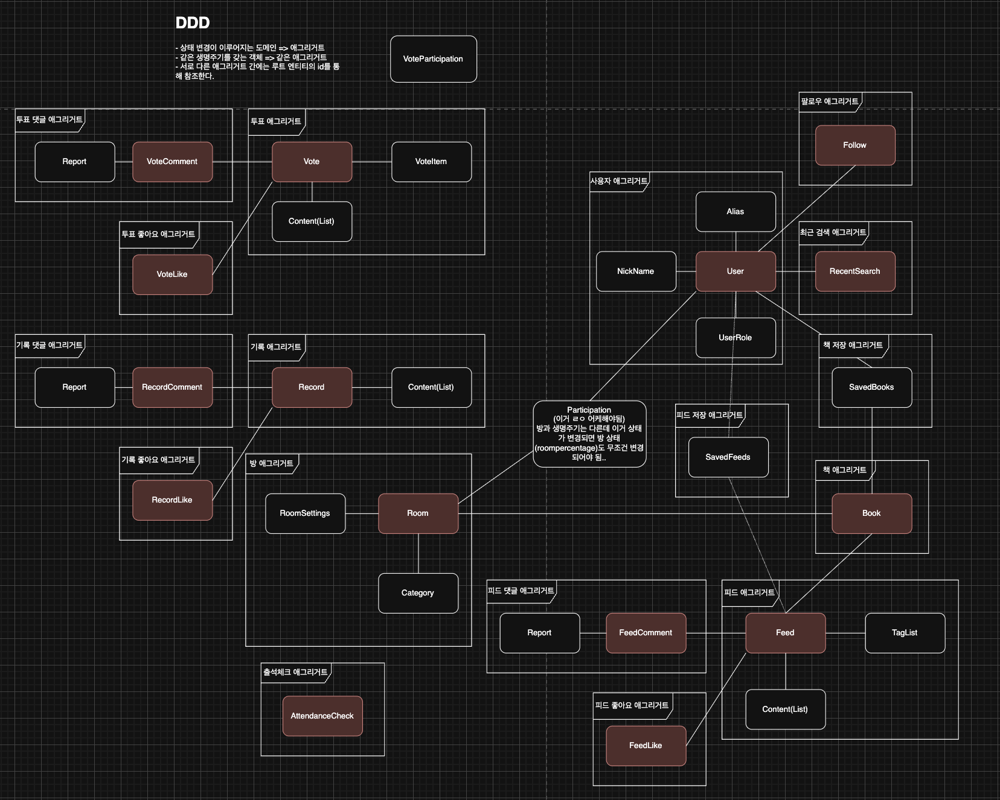

# 애그리거트

# 🌀 애그리거트

## 🍥 애그리거트

- 복잡한 도메인을 이해하고 관리하기 쉬운 단위로 만들려면 상위 수준에서 모델을 조망할 수 있는 방법이 필요 —> 그 방법이 바로 **애그리거트**



- 애그리거트는 관련된 객체를 하나의 군으로 묶어줌
    - 수많은 객체를 애그리거트로 묶어서 바라보면 상위 수준에서 도메인 모델 간의 관계를 파악 가능
- 애그리거트는 모델의 일관성을 관리하는 기준도 됨
- 애그리거트는 관련된 모델을 하나로 모았기 때문에 한 애그리거트에 속한 객체는 유사하거나 동일한 라이프 사이클을 가짐
- 한 애그리거트에 속한 객체는 다른 애그리거트에 속하지 않음
    - 애그리거트는 독립된 객체 군으로 각 애그리거트는 자기 자신을 관리할 뿐 다른 애그리거트를 관리 하지않음
    - 경계를 설정할 때 기본이 되는 것은 도메인 규칙과 요구사항
    - 도메인 규칙에 따라 함께 생성되는 구성요소는 한 애그리거트에 속할 가능성이 높음
    - “A가 B를 갖는다”로 해석할 수 있는 요구사항이 있다고 하더라도 반드시 A와B가 한 애그리거트에 속한다는 것을 의미하는 것은 아님
        - 상품 상세 페이지에 들어가면 상품 상세 정보와 함께 리뷰내용을 보여줘야한다는 요구사항이 있을때 Product 엔티티와 Review 엔티티가 한 애그리거트에 속한다고 생각할 수 있지만, **Product와 Review는 함께 생성되지 않고, 함께 변경되지도 않음**
          더불어 Product를 **변경하는 주체**가 상품 담당자라면 Review를 생성하고 변경하는 주체는 고객임

# 🌀 애그리거트 루트와 역할

## 🍥 애그리거트 루트

- 애그리거트에 속한 모든 객체가 일관된 상태를 유지하려면 애그리거트 전체를 관리할 주체가 필요한데, 그 주체가 바로 **애그리거트의 루트 엔티티**
- 루트 엔티티는 애그리거트의 대표 엔티티
    - 애그리거트에 속한 객체는 애그리거트 루트 엔티티에 직접 또는 간접적으로 속하게 됨

### 🍧 도메인 규칙과 일관성

- 애그리거트 루트의 핵심 역할은 애그리거트의 일관성이 깨지지 않도록 하는 것
    - 애그리거트 루트는 애그리거트가 제공해야할 도메인 기능을 구현
    - 애그리거트 루트가 제공하는 메서드는 도메인 규칙에 따라 애그리거트에 속한 객체의 일관성이 깨지지 않도록 구현해야 함
- 애그리거트 외부에서 애그리거트에 속한 객체를 직접 변경하면 안됨
- 불필요한 중복을 피하고 애그리거트 루트를 통해서만 도메인 로직을 구현하게 만들려면 도메인 모델에 대해 다음 두가지를 습관적으로 적용해야 함
    - 단순히 필드를 변경하는 set 메서드를 public 범위로 만들지 않는다
        - public set 메서드는 도메인의 의미나 의도를 표현하지 못하고 도메인 로직을 도메인 객체가 아닌 응용 영역이나 표현 영역으로 분산 시킴
    - 밸류 타입은 불변으로 구현한다
        - 애그리거트 외부에서 내부 상태를 함부로 바꾸지 못하므로 애그리거트의 일관성이 깨질 가능성이 줄어듬

### 🍧 애그리거트 루트의 기능 구현

- 애그리거트 루트는 애그리거트 내부의 다른 객체를 조합해 기능 완성
- 애그리거트 루트는 구성요소의 상태만 참조할 뿐만 아니라, 기능 실행을 위임하기도 함

### 🍧 트랜잭션 범위

- 트랜잭션 범위는 작을수록 좋음
    - 한 트랜잭션이 여러 테이블의 수정할 경우 락 대상이 많아져 동시에 처리할 수 있는 트랜잭션 개수가 줄어들고, 전체적인 성능(처리량)을 떨어뜨림
- 한 트랜잭션에서는 한 개의 애그리거트만 수정해야 함
    - 한 애그리거트에서 다른 애그리거트를 수정하지않는다는 것을 의미
    - 한 애그리거트 내부에서 다른 애그리거트의 상태를 변경하는 기능을 실행하면 안됨
    - 만약 부득이하게 한 트랜잭션으로 두 개 이상의 애그리거트를 수정해야 한다면 애그리거트에서 다른 애그리거트를 직접 수정하지 말고 **응용 서비스에서 두 애그리거트를 수정하도록 구현**

# 🌀 애그리거트와 리포지터리

- 애그리거트는 개념상 완전한 한 개의 도메인 모델을 표현하므로 객체의 영속성을 처리하는 리포지터리는 애그리거트 단위로 존재
- 애그리거트 루트와 애그리거트에 속하는 객체를 물리적으로 각각 별도의 DB 테이블에 저장한다고 해서 리포지토리를 각각 만들지 않음
    - 애그리거트 루트를 위한 리포지터리만 존재
- 어떤 기술을 이용해 리포지터리를 구현하느냐에 따라 애그리거트의 구현도 영향을 받음
- 애그리거트는 개념적으로 하나이므로 리포지터리는 애그리거트 전체를 저장소에 영속화해야 함
    - 애그리거트 루트와 매핑되는 테이블뿐만 아니라 애그리거트에 속한 모든 구성요소에 매핑된 테이블에 데이터를 저장해야 함

        ```java
        orderRepository.save(order);
        ```

- 애그리거트를 구하는 리포지터리 메서드는 완전한 애그리거트를 제공해야 함
    - 리포지터리가 완전한 애그리거트를 제공하지 않으면 필드나 값이 올바르지 않아 애그리거트의 기능을 실행하는 도중에 NullPointerException과 같은 문제가 발생할 수 있음

    ```java
    // 리포지터리는 완전한 order를 제공해야 함
    Order order = orderRepository.findById(orderId);
    
    // order가 온전한 애그리거트가 아니면
    // 기능 실행 도중 NullPointerException과 같은 문제 발생
    order.cancel();
    ```


# 🌀ID를 이용한 애그리거트 참조

- 한 애그리거트도 다른 애그리거트를 참조 가능
    - 애그리거트 관리주체는 애그리거트 루트이므로 애그리거트에서 다른 애그리거트를 참조한다는 것은 다른 애그리거트의 루트를 참조한다는 것과 같음
- 애그리거트 간의 참조는 필드를 통해 직접참조로 쉽게 구현 가능

  

    - JPA는 `@ManyToOne`, `@OneToOne` 과 같은 어노테이션을 이용해 연관된 객체를 로딩하는 기능을 제공하고있으므로 필드를 이용해 다른 애그리거트를 쉽게 참조 가능
    - 하지만 필드를 이용한 애그리거트 직접참조는 다음 문제를 야기함
        - **1️⃣ 편한 탐색 오용**
            - 한 애그리거트 내부에서 다른 애그리거트 객체에 접근 가능하면 다른 애그리거트의 상태를 쉽게 변경할 수 있게 됨
            - 애그리거트 간의 의존 결합도를 높여 결과적으로 애그리거트의 변경을 어렵게 만듦
        - **2️⃣ 기능에 대한 고민**
            - JPA를 사용하면 참조한 객체를 지연(lazy)로딩과 즉시(eager) 로딩의 두가지 방식으로 로딩 가능
            - 단순히 연관된 객체의 데이터를 함께 화면에 보여줘야 하면 즉시 로딩이 조회 성능에 유리하지만 애그리거트의 상태를 변경하는 기능을 실행하는 경우 불필요한 객체를 함께 로딩할 필요가 없으므로 지연 로딩이 유리할 수 있음
            - 이런 다양한 경우의 수를 고려하여 연관 매핑과 JPGL/Criteria 쿼리의 로딩 전략을 결정해야 함
        - **3️⃣ 확장 어려움**
            - 초기에는 단일 서버에 단일 DBMS로 서비스를 제공하는 것이 가능하지만 사용자가 늘고 트래픽이 증가하면 부하를 분산시키기 위해 하위 도메인별로 시스템을 분리하기 시작
            - 이 과정에서 하위 도메인마다 서로 다른 DBMS를 사용할 때도 있음
              심지어는 다른 종류의 DB를 사용하기도 함
            - 더 이상 다른 애그리거트 루트를 참조하기 위해 JPA와 같은 단일 기술을 사용할 수 없음을 의미
- 이런 문제들을 완화하기 위해 **ID를 이용해 다른 애그리거트를 참조**하는 것!

  

    - ID 참조를 사용하면 모든 객체가 참조로 연결되지 않고 한 애그리거트에 속한 객체들만 참조로 연결됨
        - 애그리거트의 경계를 명확히 하고 애그리거트 간 물리적인 연결을 제거하기 때문에 모델의 복잡도를 낮춰줌
        - 애그리거트 간의 의존을 제거하므로 응집도를 높여줌
        - 구현 복잡도도 낮아짐 (즉시로딩, 지연로딩을 더이상 고민하지 않아도 됨)
        - 애그리거트에서 다른 애그리거트를 수정하는 문제를 근원적으로 방지 가능
            - 외부 애그리거트를 직접 참조하지 않기 때문에 한 애그리거트에서 다른 애그리거트의 상태를 변경할 수 없음
        - 애그리거트별로 다른 구현 기술을 사용하는 것도 가능해짐

### 🍧 ID를 이용한 참조와 조회 성능

- 다른 애그리거트를 ID로 참조하면 참조하는 여러 애그리거트를 읽을 때 조회 속도가 문제 될 수 있음
    - 각 주문마다 상품과 회원 애그리거트를 읽어온다고 해보자
    - 한 DBMS에 데이터가 있다면 조인을 이용해서 한 번에 모든 데이터를 가져올 수 있음에도 불구하고 주문마다 상품 정보를 읽어오는 쿼리를 실행하게 됨

    ```java
    Member member = memberRepository.findById(ordererId);
    List<Order> orders = orderRepository.findBy0rderer(ordererId);
    List<OrderView> dtos = orders.stream()
    	.map (order -> {
    		ProductId prodId = order.getOrderLines().get(0).getProductId();
    		//각 주문마다 첫 번째 주문 상품 정보 로딩 위한 쿼리 실행
    		Product product = productRepository.findById(prodId);
    		return new OrderView(order, member, product);
    	}).collect(toList());
    ```

    - 주문 개수가 10개면 주문을 읽어오기 위한 1번의 쿼리와 주문별로 각 상품을 읽어오기  위한 10번의 쿼리 실행
    - **조회 대상이 N개일 때 N개를 읽어오는 한 번의 쿼리와 연관된 데이터를 읽어오는 쿼리를 N번 실행한다** —> N+1 조회 문제
- N+1 조회문제가 발생하지 않도록 하려면 조인을 사용
    - ID 참조 방식을 사용하면서 N+1 조회와 같은 문제가 발생하지 않도록 하려면 조회 전용 쿼리를 사용
    - 데이터 조회를 위한 별도 DAO를 만들고 DAO의 조회 메서드에서 조인을 이용해 한 번의 쿼리로 필요한 데이터를 로딩하면 됨
- 애그리거트마다 서로 다른 저장소를 사용하면 한 번의 쿼리로 관련 애그리거트를 조회할 수 없음
    - 조회 성능을 높이기 위해 캐시를 적용하거나 조회 전용 저장소를 따로 구성
    - 코드가 복잡해지는 단점이 있지만 시스템의 처리량을 높일 수 있다는 장점이 있음
    - 특히 한 대의 DB 장비로 대응할 수 없는 수준의 트래픽이 발생하는 경우 캐시나 조회 전용 저장소는 필수로 선택해야 하는 기법

## 🍥 애그리거트 간 집합 연관

- 애그리거트 간 1:N과 M:N 연관은 컬렉션(Collection)을 이용한 연관
    - 애그리거트 간 1:N 관계는 Set과 같은 컬렉션을 이용해 표현 가능
        - 개념적으로 존재하는 애그리거트 간의 1:N 연관을 실제 구현에 반영하는 것이 요구사항을 충족하는 것과는 상관 없을 때가 있음
        - 특정 카테고리에 속한 상품 목록을 보여주는 요구사항처럼 상품의 개수가 수만 개 정도로 많을 경우 정렬시에 이 코드를 실행할 때마다 실행 속도가 급격히 느려져 성능에 심각한 문제를 일으킬 수 있음
        - 이런 성능 문제 때문에 애그리거트 간의 1:N 연관을 실제 구현에 반영하지 않음
    - N:1 관계는 해당 객체 내에 다른 객체의 연관을 추가하고 그 연관을 이용해 요구사항을 만족하도록 하면 됨

    ```java
    public class Product {
    	...
    	private CategoryId categoryId;
    	...
    }
    ```

    - M:N 연관은 개념적으로 양쪽 애그리거트에 컬렉션으로 연관을 만듦
        - 실제 요구사항을 고려해 M:N 연관이 구현에 포함되는지 결정됨
        - 개념적으로는 양방향 M:N 연관이 존재하지만 실제 구현에서는 단방향 M:N 연관만 적용할 수 있음
          ex) 상품과 카테고리일 경우 보통 특정 카테고리에 속한 상품 목록을 보여줄때 상품이 속한 카테고리가 필요한 화면은 상품 상세 화면이므로 상품에서 카테고리의 집합 연관만 존재하면 됨
        - RDBMS를 이용해 M:N 연관을 구현하려면 조인 테이블 사용

          

        - JPA를 이용하면 다음과 같은 매핑 설정을 사용해 ID 참조를 이용한 M:N 단방향 연관을 구현 가능

        ```java
        @Entity
        @Table (name = "product")
        public class Product {
        	@EmbeddedId
        	private ProductId id;
        	@ElementCollection
        	@CollectionTable(name = "product_category",
        		joinColumns = @JoinColumn (name = "product _id"))
        	private Set<CategoryId> categoryIds;
        	…
        }
        ```


## 🍥 애그리거트를 팩토리로 사용하기

- 애그리거트가 다른 애그리거트를 생성하는 기능을 애그리거트에 구현할 수 있음

```java
public class Store {
	public Product createProduct (ProductId newProductId, ... 생략 ) {
		if (isBlocked) throw new StoreBlockedException();
		return new Product (newProductId, getId), ... 생략 ;
	}
}
```

- Store 애그리거트의 createProduct()는 Product 애그리거트를 생성하는 팩토리 역할을 함
- 팩토리 역할을 하면서도 중요한 도메인 로직을 구현하고있음
- 팩토리 기능을 구현했으므로 응용 서비스는 팩토리 기능을 이용해 Product를 생성하면 됨
- 애그리거트를 팩토리로 사용할 때 얻을 수 있는 장점들
    - 도메인 로직은 애그리거트인 도메인에서 구현하게 됨
    - Product 생성 가능 여부를 확인하는 도메인 로직을 변경해도 도메인 영역의 Store만 변경하면 되고 응용 서비스는 영향을 받지 않음
    - 도메인의 응집도가 높아지게됨

- 애그리거트가 갖고 있는 데이터를 이용해 다른 애그리거트를 생성해야 한다면 애그리거트에 팩토리 메서드를 구현하는 것을 고려해 볼것

# 📚 THIP에서의 애그리거트

- 분류 기준
    - 함께 변경되어야 하거나, 일관성을 함께 유지해야 하는 객체들
    - 생성과 소멸의 시점이 같은 객체들
    - 하나의 트랜잭션/일관성 경계로 묶여야 하는 도메인 객체들 (집합)

