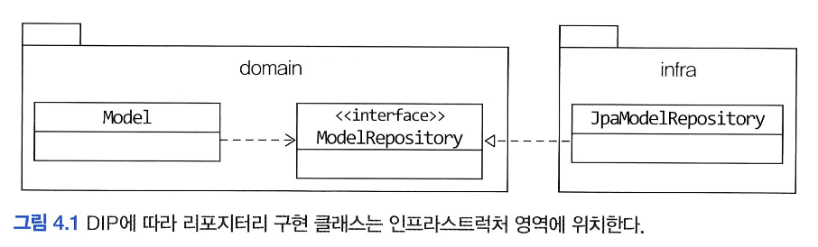
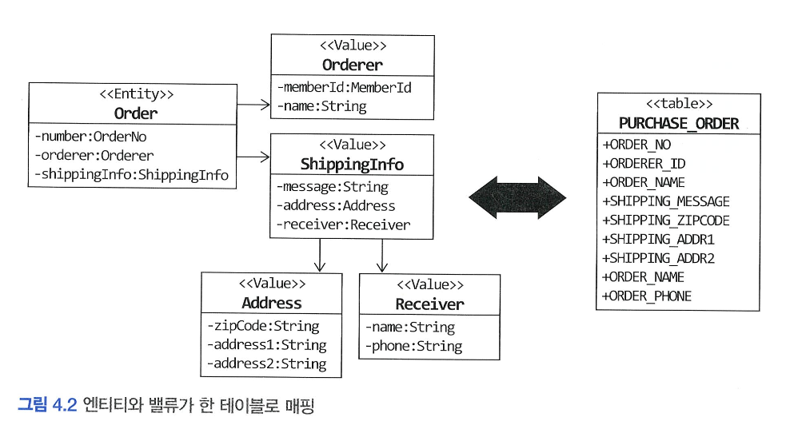
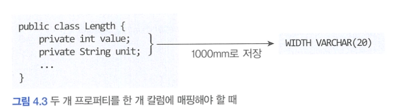
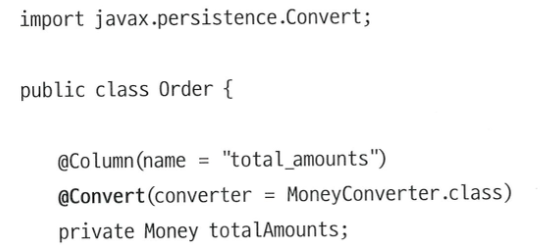
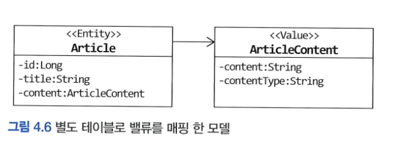
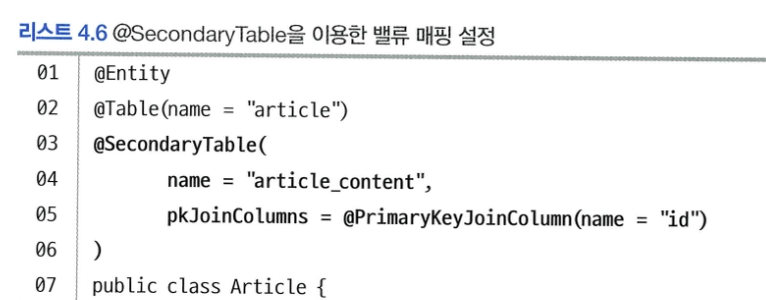
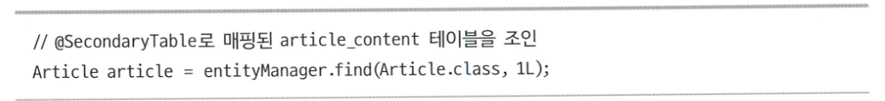
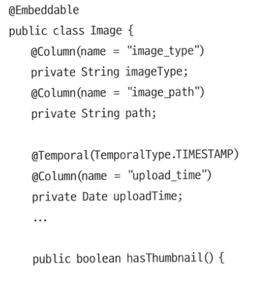
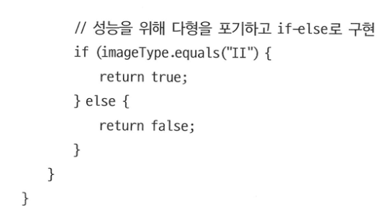

# 4️⃣ 리포지터리와 모델 구현

# 🌀 JPA를 이용한 리포지터리 구현

### 🍧 모듈 위치

- 리포지터리 인터페이스는 애그리거트와 같이 도메인 영역세 속하고, 리포지터리를 구현한 클래스는 인프라스트럭처 영역에 속함

  

- 팀 표준에 따라 리포지터리 구현 클래스를 domain.impl과 같은 패키지에 위치시킬수도 있지만 이것은 리포지터리 인터페이스와 구현체를 분리하기 위한 타협안 같은 것이지 좋은 설계 원칙을 따르는 것은 아님.
    - 리포지터리 구현 클래스를 인프라스트럭처 영역에 위치시켜서 인프라스트럭처에 대한 의존을 낮춰야 함

### 🍧 리포지터리 기본 기능 구현

- 리포지터리가 제공하는 기본 기능은 다음 두가지
    - ID로 애그리거트 조회하기
    - 애그리거트 저장하기
- 두 메서드를 위한 리포지터리 인터페이스는 다음과 같은 형식을 갖음

    ```java
    public interface OrderRepository {
    	Order findById(OrderNo no);
    	void save(Order order);
    }
    ```

- 인터페이스는 애그리거트 루트를 기준으로 작성함
- 애그리거트를 조회하는 기능의 이름을 지을때 널리 사용되는 규칙은 “**findBy프로퍼티이름(프로퍼티값)**” 형식을 사용하는 것
    - ID에 해당하는 애그리거트가 존재하면 엔티티를 리턴하고 존재하지않으면 null을 리턴.
    - null을 사용하고 싶지않으면 Optional로 묶어서 리턴
- ID가 아닌 다른 조건으로 애그리거트를 조회할 때는 findBy 뒤에 조건 대상이 되는 프로퍼티 이름을 붙임
- ID 외에 다른 조건으로 애그리거트를 조회할 때에는 JPA의 **Criteria**나 **JPQL**을 사용 할 수 있음

    ```java
    @Override
    public List<Order> findByOrdererId(String ordererId, int startRow, int fetchSize) {
    	TypedQuery<Order> query = entityManager.createQuery(
    		"select o from Order o " +
    			"where o.orderer.memberId.id = ordererId " +
    			"order by o.number number desc",
    			Order.class);
    	query.setParameter("ordererId", ordererId);
    	query.setFirstResult(startRow);
    	query.setMaxResults(fetchSize);
    	return query.getResultList();
    }
    ```

- 애그리거트를 수정한 결과를 저장소에 반영하는 메서드를 추가할 필요는 없음.
    - JPA를 사용하면 트랜잭션 범위에서 변경한 데이터를 자동으로 DB에 반영하기위해 UPDATE 쿼리를 실행하기 때문
        - `@Transactional` 을 사용한 메서드는 스프링 프레임워크의 트랜잭션 관리 기능을 통해 트랜잭션 범위에서 실행됨
        - 메서드 실행이 끝나면 트랜잭션을 커밋하는데 이때 JPA는 트랜잭션 범위에서 변경된 객체의 데이터를 DB에 반영하기 위해 UPDATE 쿼리를 실행
- 애그리거트의 삭제 기능을 위한 메서드는 삭제할 애그리거트 객체를 파라미터로 전달 받음

    ```java
    public interface OrderRepository {
    	...
    	public void delete(Order order);
    }
    ```

    - 구현 클래스는 EntityManager의 remove()메서드를 이용해 삭제 기능 구현
    - 삭제 요구사항이 있더라도 데이터를 실제로 삭제하는 경우는 많지 않음
        - 관리자 기능에서 삭제한 데이터까지 조회해야 하는 경우도 있고 데이터 원복을 위해 일정 기간 동안 보관해야 할 때도 있기 때문.
        - 사용자가 삭제 기능을 실행할 때 데이터를 바로 삭제하기보다는 삭제 플래그를 사용해서 데이터를 화면에 보여줄지 여부를 결정하는 방식으로 구현

## 🍥 스프링 데이터 JPA를 이용한 리포지터리 구현

- 스프링과 JPA를 함께 적용할 때는 스프링 데이터 JPA를 사용
- 스프링 데이터 JPA는 지정한 규칙에 맞게 리포지터리 인터페이스를 정의하면 리포지터리를 구현한 객체를 알아서 만들어 스프링 빈으로 등록해줌
- 스프링 데이터 JPA는 다음 규칙에 따라 작성한 인터페이스를 찾아 인터페이스를 구현한 스프링 빈 객체를 자동으로 등록
    - org.springframework.data.repository.Repository<T,ID> 인터페이스 상속
    - T는 엔티티 타입을 지정하고 ID는 식별자 타입을 지정

        ```java
        @Entity
        @Table (name = "purchase_order")
        @Access (AccessType.FIELD)
        public class Order {
        	@EmbeddedId
        	private OrderNo number; //OrderNo가 식별자 타입
        }
        ```

        ```java
        import org.springframework.data.repository.Repository;
        import java.util.Optional;
        public interface OrderRepository extends Repository<Order, OrderNo> {
        	Optional <Order> findById(OrderNo id);
        	void save(Order order);
        }
        ```

- 스프링 데이터 JPA를 사용하려면 지정한 규칙에 맞게 메서드를 작성해야 함
    - 저장
        - Order save(Order entity)
        - void save(Order entity)
    - 식별자를 이용해 엔티티 조회 /  findById() 메서드를 사용
        - Order findByld (OrderNo id)
        - Optional<Order> findByld (OrderNo id)
    - 특정 프로퍼티를 이용해 엔티티 조회 / findBy프로퍼티이름(프로퍼티 값) 메서드를 사용
        - List<Order> findByOrdererOrderer orderer)
        - List<Order> findByOrdererMemberld (Memberld memberld)
    - 삭제
        - void delete (Order order)
        - void deleteByld (OrderNo id)

# 🌀 엔티티와 밸류 매핑

## 🍥 엔티티와 밸류 기본 매핑 구현

- 애그리거트와 JPA 매핑을 위한 기본 규칙은 다음과 같다
    - 애그리거트 루트는 엔티티이므로 `@Entity`로 매핑 설정한다.
    - 한 테이블에 엔티티와 밸류 데이터가 같이 있다면
        - 밸류는 @Embeddable로 매핑 설정한다
        - 밸류 타입 프로퍼티는 @Embedded로 매핑 설정한다.

  

    ```java
    import javax.persistence.Entity;
    @Entity
    @Table(name = "purchase_order")
    public class Order {
    	...
    	@Embedded
    	private Orderer orderer;
    	
    	@Embedded
    	private ShippingInfo shippingInfo;
    	...
    }
    ```

    ```java
    import javax.persistence.Embeddable;
    
    @Embeddable
    public class Orderer {
    
    	// MemberId에 정의된 칼럼 이름을 변경하기 위해
    	// @AttributeOverride 애너테이션 이용
    	@Embedded
    	@AttributeOverrides(
    	@AttributeOverride(name = "id", column = @Column (name = "orderer_id"))
    	)
    	private MemberId memberId;
    	
    	@Column (name = "orderer_name")
    	private String name;
    }
    ```

    ```java
    @Embeddable
    public class MemberId implements Serializable {
    @Column(name= "member_id")
    private String id;
    ```

    ```java
    @Embeddable
    public class ShippingInfo {
    	@Embedded
    	@AttributeOverrides({
    		@AttributeOverride(name = "zipCode",
    			column = @Column (name = "shipping_zipcode")),
    		@AttributeOverride (name = "address1",
    			column = @Column (name = "shipping_addr1")),
    		@AttributeOverride (name = "address2",
    			column = @Column (name = "shipping_addr2"))
    })
    private Address address;
    
    @Column (name = "shipping_message")
    private String message;
    
    @Embedded
    private Receiver receiver;
    }
    ```


## 🍥 기본 생성자

- 앤티티와 밸류의 생성자는 객체를 생성할 때 필요한 것을 전달받음
- 밸류타입이 불변 타입이면 생성 시점에 필요한 값을 모두 전달받으므로 값을 변경하는 set 메서드를 제공하지않음
    - 이는 밸류타입 클래스에 기본 생성자를 추가할 필요가 없음을 의미함
- JPA에서 @Entity와 @Enbeddable로 클래스를 매핑하려면 **기본 생성자를 제공**해야함
    - DB에서 데이터를 읽어와 매핑된 객체를 생성할 때 기본 생성자를 사용해 객체를 생성하기 때문
- 기본 생성자는 JPA 프로바이더가 객체를 생성할 때만 사용함
    - 다른 코드에서 기본 생성자를 사용하지 못하도록 protected로 선언

## 🍥 필드 접근 방식 사용

- 앤티티가 객체로서 제 역할을 하려면 외부에 set 메서드 대신 의도가 잘 드러나는 기능을 제공해야 함
- 객제가 제공할 기능 중심으로 엔티티를 구현하게끔 유도하려면 JPA 매핑 처리를 프로퍼티 방식이 아닌 필드 방식으로 선택해서 불필요한 get/set 메서드를 구현하지말아야 함

    ```java
    @Entity
    @Access(AccessType.FIELD)
    public class Order {
    
    	@EmbeddedId
    	private OrderNo number;
    	
    	...
    }
    ```

  💡 JPA 구현체인 하이버네이트는 @Access를 이용해서 명시적으로 접근 방식을 지정하지 않으면 @Id 나 @EmbeddedId가 어디에 위치했느냐에 따라 접근 방식을 결정
  @Id 나 @EmbeddedId가 필드에 위치하면 필드 접근 방식을 선택하고 get 메서드에 위치하면 메서드 접근 방식을 선택함


## 🍥 AttributeConverter를 이용한 밸류 매핑 처리

- 밸류 타입의 프로퍼티를 한 개 칼럼에 매핑해야 할 때가 있음
- ex) Length 밸류의 value, unit 을 DB에서는 하나의 String 데이터로 관리하고 싶은 경우

  


- 두 개 이상의 프로퍼티를 가진 밸류 타입을 한 개의 컬럼에 매핑하려면 @Embeddable 어노테이션으로는 처리할 수 없다
- 이때 AttributeConverter 를 활용해 밸류 타입과 컬럼 데이터 간의 변환을 처리할 수 있다

  

  

- 밸류 타입 ↔ DB 컬럼으로 매핑하는 메서드를 AttributeConverter 에서 정의할 수 있다


- 위와 같이 AttributeConverter 의 구현체를 통해 밸류 ↔ DB 컬럼의 매핑을 구현할 수 있다
- (THIP 에서는 mapper 에서 도메인 엔티티 ↔ jpa 엔티티 의 매핑과정에서 도메인이 가지고 있는 밸류 프로퍼티를 DB의 컬럼으로 매핑한다고 생각하면 될 듯)
- AttributeConverter 인터페이스를 구현한 클래스는 @Converter 애너테이션을 적용한다
- @Converter 어노테이션의 autoApply 속성을 true로 지정하면 모델에 출현하는 모든 밸류타입의 프로퍼티에 대해 AttributeConverter 의 구현체를 자동으로 적용한다.
- @Converter 어노테이션의 autoApply 속성을 false로 지정하면(기본값) 프로퍼티 값을 변환할 때 사용할 컨버터를 직접 지정해야 한다

  


# 🌀 밸류 컬렉션 매핑

## 🍥 밸류 컬렉션:별도 테이블 매핑

- 엔티티가 한 개 이상의 엔티티/밸류를 프로퍼티로 가질 수도 있다
    - (But, 보통은 @OneToMany 와 같은 어노테이션을 지양하니, 그냥 가볍게 읽어도 될 듯?)
- ex) Order 가 List<OrderLine> orderLines 를 프로퍼티로 가진다


- 위 Order, OrderLine 을 DB에 저장할 때는 아래와 같은 RDBMS에 저장할 수 있다

  

- 밸류 컬렉션은 별도 테이블로 매핑할 때 @ElementCollection 과@CollectionTable 을 함께 사용한다


## 🍥 밸류 컬렉션:한 개 칼럼 매핑

- 엔티티가 가지는 밸류 컬렉션을 별도 테이블이 아닌, 한 개 컬럼에 저장해야할 때도 있다
    - ex) 도메인 모델에는 이메일 주소 목록을 Set 으로 보관, DB에는 한 개 컬럼에 콤마로 구분해서 저장
- 이때 AttributeConverter 를 활용하면 밸류 컬렉션을 한 개 컬럼에 쉽게 매핑할 수 있다
    - 단, 밸류 컬렉션에 해당하는 새로운 밸류 타입(= like 일급 컬렉션) 을 추가해야 한다


- List<Email> 을 위한 EmailSet 밸류타입을 정의한 후, AttributeConverter 를 구현함으로써 DB에 밸류타입의 컬렉션을 저장할 수 있다
- 아래처럼 엔티티 내부에 EmailSet 타입 프로퍼티가 AttributeConverter 의 구현체를 사용하도록 지정하면 된다


## 🍥 밸류를 이용한 ID 매핑

- 식별자라는 의미를 부각시키기 위해 식별자 자체를 밸류 타입으로 만들 수도 있다
    - ex) OrderNo 밸류 타입으로 Order 엔티티의 식별자를 감쌀 수 있다
- 밸류 타입을 식별자로 매핑하면 @Id 대신 @EmbeddedId 어노테이션을 사용한다


- JPA에서 식별자는 Serializable 타입이어야 하므로 식별자로 사용할 밸류 타입은 Serializable 인터페이스를 상속받아야 한다
- 식별자를 밸류타입으로 구현하면 식별자에 기능을 추가할 수 있다는 장점이 있다
- JPA는 내부적으로 엔티티를 비교할 목적으로 equals() 메서드와 hashcode() 값을 사용하므로 식별자로 사용할 밸류 타입은 이 두 메서드를 알맞게 구현해야 한다

## 🍥 별도 테이블에 저장하는 밸류 매핑

- 애그리거트에서 루트 엔티티를 뺀 나머지 구성요소는 대부분 밸류 타입이다
- 애그리거트에 속한 객체가 엔티티인지 밸류인지를 구분하는 방법은 **고유 식별자를 갖는지 확인**하는 것이다
    - 이때 매핑되는 DB 테이블의 식별자를 애그리거트 구성요소의 식별자와 동일한 것으로 착각하면 안된다

      → DB PK 와 도메인 엔티티의 식별자를 혼동하지 말라!


- ArticleContent 는 Article 을 내용을 담고 있는 밸류로 생각하는게 맞다
  (단순히 DB에서 테이블을 분리해서 저장하는 것일뿐)
- ARTICLE_CONTENT의 ID는 식별자이긴 하지만, 이건 ARTICLE 테이블의 데이터와 연관관계를 맺기 위함이지, ARTICLE_CONTENT 를 위한 별도의 식별자가 필요하기 때문이 아니다



- 밸류를 매핑 한 테이블을 지정하기 위해 @SecondaryTable 과 @AttributeOverride를 사용한다



- @SecondaryTable의 name 속성은 밸류를 저장할 테이블을 지정한다
- pkJoinColumns 속성은 밸류 테이블에서 엔티티 테이블로 조인할 때 사용할 칼럼을 지정한다
- @SecondaryTable을 이용하면 아래 코드를 실핼할 때 두 테이블을 조인해서 데이터를 조회한다

  

- @SecondaryTable을 사용하면 목록 화면에 보여줄 Article을 조회할 때 article_content 테이블까지 조인해서 데이터를 읽어오는데 이것은 원하는 결과가 아니다
- 이 문제를 해소하고자 ArticleContent를 엔티티로 매핑하고 Article에서 ArticleContent로의 로딩을 지연 로딩 방식으로 설정할 수도 있다.
    - 하지만 이 방식은 밸류인 모델을 엔티티로 만드는 것이므로 좋은 방법은 아니다
    - 대신 조회 전용 기능을 구현하는 방법을 사용하는 것이 좋다

## 🍥 밸류 컬렌션을 @Entity로 매핑하기

- 개념적으로 밸류인데, 구현 기술의 한계나 팀 표준때문에 @Entity를 사용해야할 때도 있다
    - ex) 제품의 이미지 업로드 방식에 따라 이미지 경로와 썸네일 이미지 제공 여부가 달라진다 할때,


→ Image 모델을 위와 같이 계층 구조로 설계할 수 있다

- 하지만 JPA는 @Embeddable 타입의 클래스 상속 매핑을 지원하지 않으므로, 상속 구조를 갖는 밸류 타입을 사용하려면 @Entity 를 사용하여 상속 매핑으로 처리해야 한다
  → 밸류 타입을 @Entity로 매핑하므로 식별자 매핑을 위한 필드 또한 추가해야 한다
- 하지만 Image 는 모델 구조상으로는 밸류이므로 Image 모델 내부에 상태 변경 메서드를 제공하지는 않는다 (단순히 상속 구조를 위해 @Entity 어노테이션만 할당)


- Image 를 상속받은 클래스는 @Entity와 @Discriminator 를 사용해서 매핑을 설정한다


- Image 가 @Entity 이므로 Product는 @OneToMany 를 이용해서 매핑을 처리한다
    - 이때 Image는 밸류타입이므로 루트 엔티티인 Product와 라이프 사이클에 의존하기 위해 cascade 속성을 지정하는게 좋다
    - DB에서 함께 삭제되도록 orphanRemoval도 true로 설정한다


- 19 행의 changeImages를 보면 clear() 메서드를 사용하고있는데 @Entity에 대한 @OneToMany 매핑에서 컬렉션의 clear() 메서드를 호출하면 삭제 과정이 효율적이지는 않다.
- 하이버네이터의 경우 @Entity를 위한 컬렉션 객체의 clear() 메서드를 호출하면 select 쿼리로 대상 엔티티를 로딩하고, 각 개별 엔티티에 대해 delete 쿼리르 실행한다
- 하이버네이트는 @Embeddable 타입에 대한 컬렉션의 clear() 메서드를 호출하면 컬렉션에 속한 객체를 로딩하지 않고 한 번의 delete 쿼리로 삭제 처리를 수행한다.
- 따라서 애그리거트의 특성을 유지하면서 이 문제를 해소하려면 결국 상속을 포기하고 @Embeddable 로 매핑된 단일 클래스로 구현해야 한다.
- 물론 타입에 따라 다른 기능을 구현하려면 if-else를 써야한다.

  

  


## **🍥 ID 참조와 조인 테이블을 이용한 단방향 M-N 매핑**

- 애그리거트간 집한 연관은 성능 상의 이유로 피하는게 좋지만, 요구사항을 구현하는데 집합 연관을 사용하는 것이 유리하다면 ID 참조를 이용한 단방향 집합 연관을 적용할 수 있다

  

    - Product 에서 Category 로의 단방향 M-N 연관을 ID 참조 방식으로 구현
- 애그리거트를 직접 참조하는 방식은 영속성 전파, 로딩 전략을 고민해야하지만, ID 참조 방식은 이런 고민들로부터 자유롭다

# 🌀 애그리거트 로딩 전략과 영속성 전파

- JPA 매핑을 설정할 때는 애그리거트에 속한 객체가 모두 모여야 완전한 하나가 된다는 것을 명심해야 한다
- 즉, 애그리거트 루트를 로딩하면 루트에 속한 모든 객체가 완전한 상태여야 한다

- 조회 시점에서 애그리거트를 완전한 상태가 되도록 하려면, 애그리거트 루트에서 연관 매핑의 조회 방식을 ‘즉시 로딩’ 으로  설정하면 된다


- 하지만 ‘즉시 로딩’ 전략은 항상 좋은 것은 아니다


- 위와 같이 애그리거트 루트인 Product가 @Entity 로 구현한 Image, @Embeddable 로 구현한 Option 목록을 가지고 있다고 하자
- 이때 Product를 조회한다면, 하이버네이트는 Product, Image, Option들을 모두 조인한 조회 쿼리를 실행한다


- 보통은 조회 성능 문제때문에 즉시 로딩 방식을 사용하지만, 즉시 로딩 시에 같이 조회되는 데이터 수가 많아지면 오히려 성능이 떨어질 수도 있다
    - JPA 즉시 로딩 vs 지연 로딩

      JPA의 로딩 전략에는 크게 두 가지가 있습니다.

        1. **지연 로딩(LAZY loading)**

      연관된 데이터를 실제로 접근하는 시점까지 조회를 미루는 방식입니다.

        - **장점:**
            - 불필요한 연관 데이터까지 미리 가져오지 않으므로 초기 조회 쿼리가 가볍고, 메모리 사용량을 아낄 수 있습니다.
        - **단점:**
            - 연관 데이터를 반복해서 접근할 때마다 추가로 SQL이 실행되면, 부모 엔티티 1개 조회 + 자식 엔티티 N개 조회 → 총 N+1번의 쿼리가 발생합니다.
            - 네트워크 왕복(latency) 비용이 커져 성능 저하가 심해질 수 있습니다.
        1. **즉시 로딩(EAGER loading)**

      엔티티를 조회할 때 연관된 엔티티를 함께 JOIN하여 한 번에 가져오는 방식입니다.

        - 장점:
            - 한번의 조인 쿼리로 연관 데이터를 모두 불러오기 때문에, N+1 문제를 회피할 수 있습니다.
        - 단점:
            - 실제로는 필요 없는 연관 데이터까지 모두 가져오기 때문에, 데이터 양이 많아지면 오히려 조회 부담이 커질 수 있습니다.

        ---

      ### **N+1 문제 예시**

        ```java
        - - 지연 로딩(LAZY)로 Member → Order 목록을 꺼낼 때
        select * from MEMBER; -- 1번
        select * from ORDERS where MEMBER_ID = 1; -- 2번
        select * from ORDERS where MEMBER_ID = 2; -- 3번
        ...
        select * from ORDERS where MEMBER_ID = N; -- N+1번
        ```

        ```java
        - 즉시 로딩(EAGER) 또는 JPQL Fetch Join 사용 시
        select m.*, o.*
        from MEMBER m
        join ORDERS o on o.MEMBER_ID = m.ID; -- 1번
        ```

        - **지연 로딩**을 쓰면, member.getOrders()를 호출할 때마다 DB에 추가 쿼리를 보내므로 N+1번의 왕복이 발생
        - **즉시 로딩**(또는 JOIN FETCH)을 쓰면 한 번의 조인 쿼리로 모든 데이터를 가져와서, 쿼리 수가 1번으로 줄어듦

        ---

      ### **언제 즉시 로딩을 쓰는 게 좋을까?**

        - **목록 조회 후 곧바로 연관 데이터를 모두 사용**해야 하는 경우
          예: 화면에 회원과 그 회원의 주문 내역을 한꺼번에 보여줘야 할 때
        - **N+1 문제로 인해 성능 병목이 발생**하고 있다는 프로파일링 결과가 있을 때

      그렇지 않은 경우에는 **지연 로딩**을 기본으로 두고, 필요할 때만 JPQL의 FETCH JOIN이나 Spring Data JPA의 @EntityGraph 등을 사용해 특정 조회에 한정해 즉시 로딩을 적용하는 것이 훨씬 유연하고 안전합니다.

- 애그리거트는 개념적으로 하나여야 하지만, 루트 엔티티가 로딩되는 시점에 애그리거트에 속한 모든 객체가 로딩되어야 하는 것은 아니다
- JPA는 트랜잭션 범위 내에서 지연 로딩을 허용하므로, 실제로 모델의 상태를 변경하는 시점에 필요한 구성요소만 로딩해도 문제가 되지 않는다


- 결론 : 무조건 즉시 로딩이나 지연 로딩으로만 설정하기보다는 애그리거트에 맞게 선택하는게 좋다

<aside>
💡

보통 어플리케이션에서 상태 변경 기능 실행 빈도보다는 조회 기능 실행 빈도가 훨씬 더 높다

하지만 조회 기능은 모든 애그리거트의 데이터를 준비하기보다는, 별도의 조회 전용 기능과 모델을 구현하는 것이 훨씬 효과적이다

그러므로 조회 성능을 위해(= N+1 문제를 막기 위해) 애그리거트의 모든 연관관계를 즉시 로딩으로 설정할 필요가 없다

또한 상태 변경을 위해 지연 로딩을 사용할 때 발생되는 추가 쿼리로 인한 실행 속도 저하는 보통 문제되는 수준이 아니다

따라서 지연 로딩으로 설정하는 것이 일반적이기는 하다

</aside>

## 🍥 애그리거트의 영속성 전파

- 애그리거트 루트를 조회할 때뿐만 아니라, 저장, 삭제할 때도 하나로 처리해야한다


- @Embeddable 매핑 타입은 디폴트 설정이 함께 저장, 삭제 되는 것이므로 cascade 속성을 추가하지 않아도 된다
- 하지만 @Entity 매핑 타입은 cascade 속성을 설정해줘야 한다
    - @OneToMany, @OneToOne 는 cascade 속성의 기본값이 없으므로 설정해주어야 한다


# 🌀 식별자 생성 기능

- 식별자는 크게 3가지 방식 중 하나로 생성한다
    - 사용자가 직접 생성
    - 도메인 로직으로 생성
        - 식별자 생성 규칙이 있다면 엔티티를 생성할 때 식벽자를 엔티티가 별도 서비스로 식별자 생성기능을 분리해야 한다
        - 식별자 생성규칙은 도메인 규칙이므로 도메인 영역에 식별자 생성기능을 위치시켜야 한다
        - 응용 서비스는 이 도메인 서비스를 이용해서 식별자를 구하고 엔티티를 생성한다
        - 식별자 생성 규칙을 구현하기에 적합한 또 다른 장소는 리포지터리다.
            - 리포지터리 인터페이스에 식별자를 생성하는 메서드를 추가하고 리포지터리 구현 클래스에서 구현하면된다
    - DB를 이용한 일련번호 사용
        - DB 자동 증가 칼럼을 식별자로 사용하면 식별자 매핑에서 @GeneratedValue를 사용한다

          

        - 자동 증가 칼럼은 DB의 insert 쿼리를 실행해야 식별자가 생성되므로 도메인 객체를 리포지터리에 저장할 때 식별자가 생성된다
        - 도메인 객체를 생성하는 시점에는 식별자를 알 수 없고 도메인 객체를 저장한 뒤에 식별자를 구할 수 있음을 의미한다

## 🍥 도메인 구현과 DIP

- jpa 엔티티를 도메인 엔티티로 활용하면, 도메인 엔티티는 @Entity, @Table, @Id, @Column 과 같은 JPA 구현 기술에 의존하게 된다
- 따라서 도메인 모델이 영속성 구현 기술에 의존하게 되므로 DIP를 위배된다
- 도메인 패키지에 위치하는 리포지터리 인터페이스도 마찬가지로 Spring Data JPA의 Repository 인터페이스를 상속하므로 도메인이 인프라에 의존하게 된다

- 따라서 구현 기술에 대한 의존 없이 도메인을 순수하게 유지하려면 스프링 데이터 JPA의 Repository 인터페이스를 상속받지 않도록 수정하고 ArticleRepository 인터페이스를 구현한 클래스를 인프라에 위치시켜야 한다.
- 또한 Article 클래서에서 @Entity나 @Table과 같이 JPA에 특화된 어노테이션을 모두 지우고 인프라에 JPA를 연동하기 위한 클래스를 추가 해야 한다


→ 이때 ArticleRepository 가 THIP에서의 application/out/port 에 해당된다

<aside>
💡

### **필자의 생각**

DIP를 적용하는 주된 이유는 저수준 구현이 변경되더라도 고수준이 영향을 받지 않도록 하기 위함이다

하지만 리포지터리와 도메인 모델의 구현 기술은 거의 바뀌지 않는다

(Spring Data JPA를 활용하다, 마이바티스로 구현 기술을 변경하는 상황이 올까? 라는 의미)

따라서 필자는 애그리거트, 리포지터리 등 도메인 모델을 구현할 때 JPA 기술에 의존적이도록 어느정도 타협을 했다

→ 이러면 구현이 쉬워지고, Spring Data JPA의 기술들을 적극적으로 이용할 수 있다는 장점이 있을 듯

</aside>