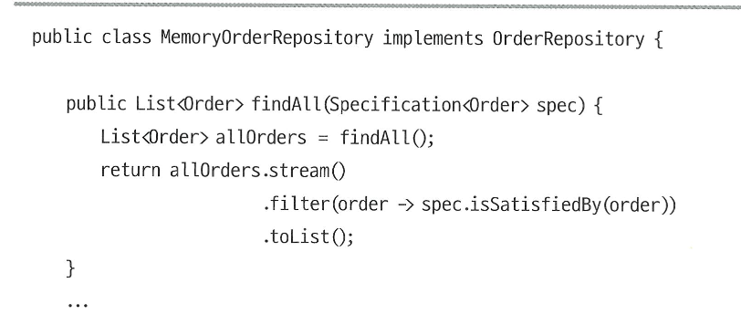
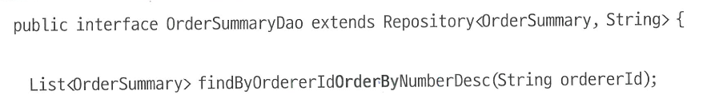
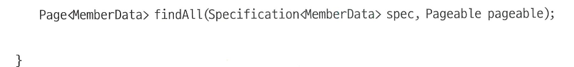
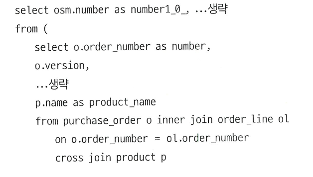

# 5️⃣ 스프링 데이터 JPA를 이용한 조회 기능

- 이 장에서 사용하는 예제코드는 리포지터리(도메인 모델에 속한)와 DAO(데이터 접근을 의미하는)라는 이름을 혼용해서 사용한다

# 🌀 스펙

## 🍥 검색을 위한 스펙

- 검색조건이 고정되어있고 단순하면 특정 조건으로 조회하는 기능을 만들면 된다

  

- 목록 조회와 같이 다양한 검색 조건을 조합해야 할 때 사용할 수 있는 것이 **스펙(Specification)**이다.
- **스펙은 애그리거트가 특정 조건을 충족하는지를 검사할 때 사용하는 인터페이스다.**

  

    - isSatisfiedBy() 메서드의 agg 파라미터는 검사 대상이 되는 객치다
    - 스펙을 리포지터리에 사용하면 agg는 애그리거트 루트가 되고, 스펙을 DAO에 사용하면 agg는 검색 결과로 리턴할 데이터 객체가 된다
    - isSatisfiedBy() 메서드는 검사 대상 객체가 조건을 충족하면 true를 리턴하고, 그렇지 않으면 false를 리턴한다

  

  Order 애그리거트 객체가 특정 고객의 주문인지 확인하는 스펙을 구현한 코드

- 리포지터리나 DAO는 검색 대상을 걸러내는 용도로 스펙을 사용한다



- 리포지터리가 스펙을 이용해서 검색 대상을 걸러주므로 특정 조건을 충족하는 애그리거트를 찾고 싶으면 원하는 스펙을 생성해서 리포지터리에 전달해 주기만 하면된다

  

  


- 하지만 실제 스펙은 이렇게 구현하지 않는다.
    - 모든 애그리거트 객체를 메모리에 보관하기도 어렵고 설사 메모리에 다 보관할 수 있다 하더라도 조회 성능에 심각한 문제가 발생하기 때문이다
- 실제 스펙은 사용하는 기술에 맞춰 구현하게 된다

# 🌀 JPA 스펙 구현

## 🍥 스프링 데이터 JPA를 이용한 스펙 구현

- 스프링 데이터 JPA는 검색 조건을 표현하기 위한 인터페이스인 Specification을 제공하며 다음과 같이 정의되어 있다.

  

    - 지네릭 타입 파라미터 T는 JPA 엔티티 타입을 의미한다.
    - toPredicate() 메서드는 JPA 크리테리아(Criteria) API에서 조건을 표현하는 Predicate을 생성한다.
    - JPA Criteria API에서의 **Predicate**

      JPA Criteria API에서 **Predicate**는

      SQL의 WHERE 절에 들어가는 **조건(논리식)**을 자바 코드로 표현한 객체입니다.

      ### 핵심 요약

        - **Predicate**는 Criteria API에서 **조건**을 나타내는 객체입니다.
        - SQL의 WHERE, AND, OR, NOT 등 모든 조건을 Predicate로 표현합니다.
        - 여러 Predicate를 and(), or() 등으로 조합할 수 있습니다.

        ```java
        // CriteriaBuilder, CriteriaQuery, Root 준비
        CriteriaBuilder cb = entityManager.getCriteriaBuilder();
        CriteriaQuery<User> cq = cb.createQuery(User.class);
        Root<User> user = cq.from(User.class);
        
        // Predicate 생성 (조건)
        Predicate nameIsJohn = cb.equal(user.get("name"), "John");
        Predicate ageOver20 = cb.greaterThan(user.get("age"), 20);
        
        // 여러 조건을 and/or로 결합
        Predicate complex = cb.and(nameIsJohn, ageOver20);
        
        // 쿼리에 조건 적용
        cq.where(complex);
        
        // 실행
        List<User> result = entityManager.createQuery(cq).getResultList();
        ```

      ### Predicate의 주요 특징

        - **조건 표현:**
            - **`cb.equal(...)`**, **`cb.greaterThan(...)`**, **`cb.like(...)`** 등으로 만듭니다.
        - **복합 조건:**
            - **`cb.and(...)`**, **`cb.or(...)`**로 여러 Predicate를 결합할 수 있습니다.
        - **동적 쿼리:**
            - 조건을 List<Predicate>로 모아서, 필요할 때만 추가하는 방식으로 동적 쿼리를 쉽게 만들 수 있습니다.

  

  다음에 해당하는 스펙을 구현한 코드
   1. 엔티티 타입이 OrderSummary다
   2. orderId 프로퍼티 값이 지정한 값과 동일하다

   - JPA 정적 메타 모델

     

- 스펙 구현 클래스를 개별적으로 만들지 않고 별도 클래스에 스펙 생성 기능을 모아도 된다.

  

  OrderSummary와 관련된 스펙 생성 기능을 한 클래스에 모을 수 있다.

    - 스펙 인터페이스는 함수형 인터페이스이므로 15-17행, 22-24행처럼 람다식을 이용해서 객체를 생성할 수 있다.

## 🍥 리포지터리/DAO에서 스펙 사용하기

- 스펙을 충족하는 엔티티를 검색하고 싶다면 스펙 인터페이스를 파라미터로 갖는 findAll() 메서드를 사용하면 된다.

  

  


## 🍥 스펙 조합

- 스프링 데이터 JPA가 제공하는 스펙 인터페이스는 스펙을 조합할 수 있는 두 메서드를 제공하고 있다.
    - 이 두 메서드는 **and**와 **or**다.

  

- and()와 or() 메서드는 기본 구현을 가진 디폴트 메서드이다.
    - and() 메서드는 두 스펙을 모두 충족하는 조건을 표현하는 스펙을 생성한다
    - or() 메서드는 두 스펙 중 하나 이상 충족하는 조건을 표현하는 스펙을 생항한다.

  

  spec1과 spec2를 모두 충족하는 조건을 표현하는 spec3을 생성한다

    - 개별 스펙 조건마다 변수를 선언하지 않아도 된다.

  

- 스펙 인터페이스는 not() 메서드도 제공한다.
    - not()은 정적 메서드로 조건을 반대로 적용할 때 사용한다.

  

- null 가능성이 있는 스펙 객체와 다른 스펙을 조합해야 할 때가있는데, 이때 NullPointerException이 발생하는 것을 방지해야 하기때문에 null 여부를 매번 검사하기가 번거로울 수 있다.
- **where()** 메서드를 사용하면 이런 귀찮음을 줄일 수 있다.
    - where() 메서드는 스펙 인터페이스의 정적 메서드로 null을 전달하면 아무 조건도 생성하지 않는 스펙 객체를 리턴하고 null이 아니면 인자로 받은 스펙 객체를 그대로 리턴한다

  


# 🌀 정렬과 페이징

## 🍥 정렬 지정하기

- 스프링 데이터 JPA는 두 가지 방법을 사용해서 정렬을 지정할 수 있다.
    - 메서드 이름에 OrderBy를 사용해서 정렬 기준 지정
    - Sort를 인자로 전달

### 🍧 메서드 이름에 OrderBy를 사용해서 정렬 기준 지정



- findByOrderIdOrderByNumberDesc 메서드는 다음 조회 쿼리를 생성한다
    - oredererId 프로퍼티 값을 기주으로 검색 조건 지정
    - number 프로퍼티 값 역순으로 정렬
- 두 개 이상의 프로퍼티에 대한 정렬 순서를 지정할 수도 있다.
    - `findByOrdererIdOrderByOrderDateDescNumberAsc`
        - OrderDate 프로퍼티를 기준으로 내림차순으로 정렬하고 다음에 Number 프로퍼티를 기준으로 오름차순으로 정렬하는 쿼리를 생성한다.
- 메서드 이름에 OrderBy를 사용하는 방법은 간단하지만 정렬 기준 프로퍼티가 두 개 이상이면 메서드 이름이 길어지는 단점이 있다.
- 또한 메서드 이름으로 정렬 순서가 정해지기 때문에 상황에 따라 정렬 순서를 변경할 수도 없다
- 이럴 때 Sort 타입을 사용하면 된다

### 🍧 Sort를 인자로 전달

- 스프링 데이터 JPA는 정렬 순서를 지정할 때 사용할 수 있는 Sort 타입을 제공한다.

  

- 스프링 데이터 JPA는 파라미터로 전달 받은 Sort를 사용해서 알맞게 정렬 쿼리를 생성한다.

  

- 두 개 이상의 정렬 순서를 지정하고 싶다면 Sort.and() 메서드를 사용해서 두 Sort 객체를 연결하면 된다

  

  

  위와 같이 짧게 표현할 수도 있다


## 🍥 페이징 처리하기

- 스프링 데이터 JPA는 페이징 터리를 위해 Pageable 타입을 이용한다.
- Sort 타입과 마찬가지로 find 메서드에 Pageable 타입 파라미터를 사용하면 페이징을 자동으로 처리해 준다.

  

- Pageable 타입은 인터페이스로 실제 Pageable 타입 객체는 PageRequest 클래스를 이용해서 생성한다.

  

- PageRequest.of() 메서드의 첫 번째 인자는 페이지 번호를, 두번째 인자는 한 페이지의 개수를 의미한다.
    - 페이지 번호는 0번부터 시작하므로 위 코드는 11~20번째의 데이터를 조회한다
- PageRequest와 Sort를 사용하면 정렬 순서를 지정할 수있다.

  

- Page 타입을 사용하면 데이터 목록뿐만 아니라 조건에 해당하는 전체 개수도 구할 수 있다.

  

    - Pageable을 사용하는 메서드의 리턴 타입이 Page일 경우 스프링 데이터 JPA는 목록 조회 쿼리와 함께 COUNT 쿼리도 실행해서 조건에 해당하는 데이터 개수를 구한다.

      

      Page가 제공하는 메서드의 일부를 보여준다

- 스펙을 사용하는 findAll() 메서드도 Pageable을 사용할 수 있다.

  

  


- 프로퍼티를 비교하는 findBy프로퍼티 형식의 메서드는 Pageable 타입을 사용하더라도 리턴 타입이 List면 COUNT 쿼리를 실행하지 않는다

  

  두 번째 findByNameLike 메서드는 전체 개수를 구하기 위한 COUNT 쿼리를 실행하지 않는다.

    - 페이징 처리와 관련된 정보가 필요 없다면 Page 리턴 타입이 아닌 List를 사용해서 COUNT 쿼리를 실행하지 않도록 한다.
- 반면에 스펙을 사용하는 findAll 메서드에 Pageable 타입을 사용하면 리턴 타입이 Page가 아니어도 COUNT 쿼리를 실행한다.
    - 스펙을 사용하고 페이징 처리를 하면서 COUNT 쿼리는 실행하고 싶지 않다면 스프링 데이터 JPA가 제공하는 커스텀 리포지터리 기능을 이용해서 직접 구현해야 한다.
- 처음부터 N개의 데이터가 필요하다면 Pageable 사용하지 않고 findFirstN 형식의 메서드를 사용할 수도 있다.
    - `List <MemberData> findFirst3ByNameLikeOrderByName(String name)`
        - name 프로퍼티 기준으로 like를 검색한결과를 name 프로퍼티를 기준으로 오름차순으로 정렬해서 처음 3개를 조회한다.
    - First 대신 Top을 사용해도 된다.
    - Fist나 Top 뒤에 숫자가 없으면 한 개 결과만 리턴한다.

## 🍥 스펙 조합을 위한 스펙 빌더 클래스

- 스펙을 생성하다 보면 조건에 따라 스펙을 조합해야 할 때가 있다.
- 스펙 빌더를 만들어 사용하면 간편하게 구현할 수 있다.

  


# 🌀 동적 인스턴스와 @Subselect

## 🍥 동적 인스턴스 생성

- JPA는 쿼리 결과에서 임의의 객체를 동적으로 생성할 수 있는 기능을 제공하고 있다.

  

    - JPQL의 select 절을 보면 new 키워드가 있다.
    - new 키워드 뒤에 생성할 인스턴스의 완전한 클래스 이름을 지정하고 괄호 안에 생성자에 인자로 전달할 값을 지정한다.
- 조회 전용 모델을 만드는 이유는 표현 영역을 통해 사용자에게 데이터를 보여주기 위함이다.
- 동적 인스턴스의 장점은 JPQL을 그대로 사용하므로 객체 기준으로 쿼리를 작성하면서도 동시에 지연/즉시 로딩과 같은 고민 없이 원하는 모습으로 데이터를 조회할 수 있다는 점이다.

## 🍥 하이버네이트 @Subselect 사용

- @Subselect는 쿼리 결과를 @Entity로 매핑할 수 있는 유용한 기능이다.


- @Immutable, @Subselect, @Synchronize는 하이버네이트 전용 어노테이션인데 이 태그를 사용하면 테이블이 아닌 쿼리 결과를 @Entity로 매핑할 수 있다.
- @Subselect는 조회(Select) 쿼리를 값으로 갖는다.
- 하이버네이트는 이 select 쿼리 실행 결과를 매핑할 테이블처럼 사용한다.
    - DBMS가 여러 테이블을 조인해서 조회한 결과를 한 테이블처럼 보여주기 위한 용도로 뷰를 사용하는 것처럼 말이다
- 뷰를 수정할 수 없듯이 @Subselect로 조회한 @Entity 역시 수정할 수 없다.
    - @Immutable을 사용하면 하이버네이트는 해당 엔티티의 매핑 필드/프로퍼티가 변경되도 DB에 반영하지 않고 무시한다.


- 하이버네이트는 트랜잭션을 커밋하는 시점에 변경사항을 DB에 반영하므로 변경내역을반영하지 않은 상태에서 조회하게 된다.
- 이런 문제를 해소하기 위한 용도로 사용한 것이 @Synchronize이다.
- @Synchronize는 해당 엔티티와 관련된 테이블 목록을 명시한다.
    - 하이버네이트는 엔티티를 로딩하기 전에 지정한 테이블과 관련된 변경이 발생하면 플러시(flush)를 먼저한다
    - 따라서 해당 엔티티를 로딩하는 시점에서는 변경 내역이 반영된다
- @Subselect를 사용해도 일반 @Entity와 같기 때문에 EntityManager.find(), JPQL, Criteria, 스펙을 사용해서 조회할 수 있다는 것이 장점이다

  

- @Subselect는 @Subselect의 값으로 지정한 쿼리를 from 절의 서브 쿼리로 사용한다.

  

  

- @Subselect를 사용할 때는 쿼리가 이런 형태를 갖는다는 점을 유념해야 한다.
    - 서브 쿼리를 사용하고 싶지 않다면 네이티브 SQL 쿼리를 사용하거나 마이바티스와 같은 별도 매퍼를 사용해서 조회 기능을 구현해야 한다