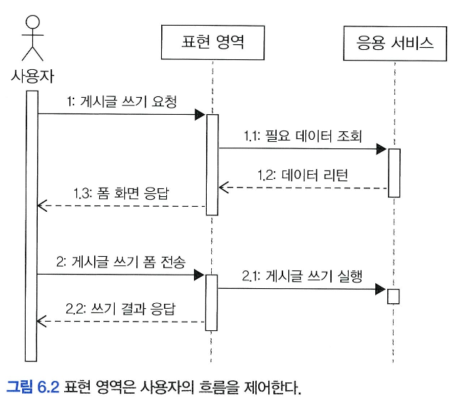
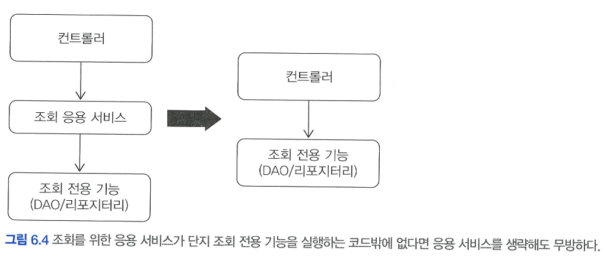
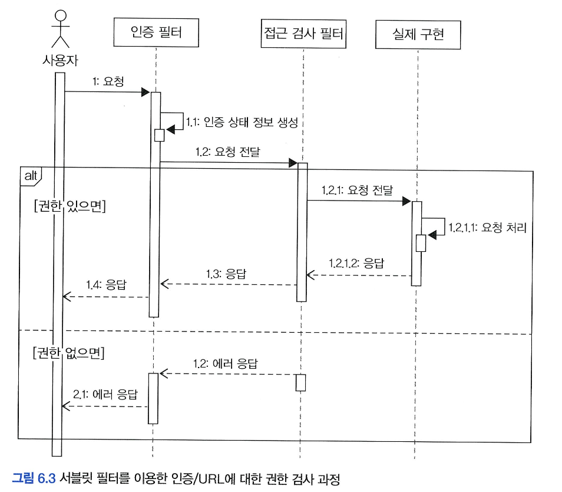

# 6️⃣ 응용 서비스와 표현 영역

# 🌀 응용 서비스 구현

## 🍥 표현 영역과 응용 영역

- 도메인 기능을 외부에 전달하려면 사용자와 도메인을 연결해주는 **"매개체"**가 필요함.
- 이 매개체가 바로 **표현 영역(Presentation Layer)**과 **응용 영역(Application Layer)**임.

### 🍧 표현 영역 (Presentation Layer)

- 사용자 요청(예: 웹 브라우저의 폼 요청)을 해석.
- HTTP 요청(URL, 파라미터, 헤더 등)을 분석하여 사용자가 원하는 기능을 파악.
- 응용 서비스(Application Service)를 호출해 실제 기능을 수행하도록 지시.
- 응용 서비스에 맞는 요청 형식(객체 등)으로 사용자 입력을 변환.
- 처리 결과를 HTML, JSON 등 사용자에게 적절한 형식으로 응답함.

```java
@PostMapping("/member/join")
public ModelAndView join(HttpServletRequest request) {
    String email = request.getParameter("email");
    String password = request.getParameter("password");

    *// 1. 사용자 요청을 응용 서비스가 이해할 수 있는 형식으로 변환*
    JoinRequest joinReq = new JoinRequest(email, password);

    *// 2. 응용 서비스 호출*
    joinService.join(joinReq);

    *// 3. 결과 응답 (예: view 반환)*
    return new ModelAndView("joinSuccess");
}
```

### 🍧 응용 영역 (Application Layer)

- 실제 비즈니스 로직을 가지지 않으며, 도메인의 기능을 조합하고 실행함.
- 기능 실행에 필요한 데이터를 파라미터로 받고, 작업 결과를 반환함.
- 표현 영역이나 외부 요청 방식(웹, REST API, 소켓 등)에 의존하지 않음.

## 🍥 응용 서비스의 역할

**응용 서비스란?**

- 사용자의 요청을 받아서 **도메인 객체를 이용해 기능을 수행**하는 계층
- **표현 영역(사용자)과 도메인 영역을 연결**하는 창구 역할

**📌  응용 서비스의 기본 흐름**

```java
public Result doSomeFunc(SomeReq req) {
    // 1. 리포지터리에서 애그리거트 조회
    SomeAgg agg = someAggRepository.findById(req.getId());
    checkNull(agg);

    // 2. 애그리거트의 도메인 기능 실행
    agg.doFunc(req.getValue());

    // 3. 결과 반환
    return createSuccessResult(agg);
}
```

**📌  애그리거트를 생성하는 경우**

```java
public Result doSomeCreation(CreateSomeReq req) {
    // 1. 입력 데이터 유효성 검사
    validate(req);

    // 2. 애그리거트 생성
    SomeAgg newAgg = createSome(req);

    // 3. 리포지터리에 저장
    someAggRepository.save(newAgg);

    // 4. 결과 반환
    return createSuccessResult(newAgg);
}
```

**응용 서비스의 또 다른 책임 : 트랜잭션 처리**

- **도메인의 상태 변화는 트랜잭션으로 감싸야 함**
- ex) 다수 회원 차단

```java
public void blockMembers(String[] blockingIds) {
    if (blockingIds == null || blockingIds.length == 0) return;

    List<Member> members = memberRepository.findByIdIn(blockingIds);
    for (Member mem : members) {
        mem.block();
    }
}
```

> ⚠️ 위 메서드가 트랜잭션 범위 밖에서 실행되면, 일부 회원만 차단된 상태로 DB에 반영되어 데이터 불일치 발생 가능성이 있음.
> 

→ 따라서, 반드시 트랜잭션 범위 내에서 실행해야 함 

### 🍧 도메인 로직 넣지 않기

- 응용 서비스는 도메인 로직을 구현하지 않아야 한다.
- 도메인 로직은 반드시 **도메인 영역에 위치**해야 하며, 응용 서비스는 도메인 객체의 흐름을 제어하는 역할만 맡는다.
    - ex) 암호 변경 기능

```java
public class ChangePasswordService {
    public void changePassword(String memberId, String oldPw, String newPw) {
        Member member = memberRepository.findById(memberId);
        checkMemberExists(member);
        member.changePassword(oldPw, newPw); // 도메인 객체에 책임 위임
    }
}
```

- **`Member`** 도메인 객체가 암호 검증과 변경 책임을 가진다

```java
public class Member {
    public void changePassword(String oldPw, String newPw) {
        if (!matchPassword(oldPw)) {
            throw new BadPasswordException();
        }
        setPassword(newPw);
    }

    public boolean matchPassword(String pwd) {
        return passwordEncoder.matches(pwd, this.password);
    }

    private void setPassword(String newPw) {
        if (isEmpty(newPw)) {
            throw new IllegalArgumentException("no new password");
        }
        this.password = newPw;
    }
}
```

- ❌ 잘못된 구현 예시 – 응용 서비스에서 로직 처리

```java
public class ChangePasswordService {
    public void changePassword(String memberId, String oldPw, String newPw) {
        Member member = memberRepository.findById(memberId);
        checkMemberExists(member);

        // ❌ 도메인 로직을 응용 서비스에서 처리
        if (!passwordEncoder.matches(oldPw, member.getPassword())) {
            throw new BadPasswordException();
        }

        member.setPassword(newPw);
    }
}
```

- 이렇게 도메인 로직이 응용 서비스에 들어가면 다음과 같은 문제 발생
    1. **응집도 저하**
        - 도메인 데이터(**`password`**)는 **`Member`**에 있는데, 이를 검증하는 로직은 **`Service`**에 있음
        - 로직을 이해하기 위해 여러 클래스를 살펴야 함
    2. **중복 로직 발생**
        - 다른 기능(예: 계정 정지)에서도 암호 검증이 필요할 수 있음
        - 응용 서비스마다 동일한 검증 코드가 반복될 가능성 큼

## 🍥 응용 서비스의 구현

### 🍧 응용 서비스의 크기

- 응용 서비스는 표현 영역과 도메인 영역을 연결하는 역할을 한다.
- 기능별로 응용 서비스를 구현하는 방식에는 두 가지가 있음:
    1. 하나의 클래스에 도메인 기능을 모두 구현
    2. 기능마다 클래스를 나눠서 구현

**① 하나의 클래스에 모든 기능 구현**

- ex) **`MemberService`** 클래스에 회원 가입, 탈퇴, 비밀번호 초기화 등 모든 기능 포함
- **👍🏻 장점**
    - 공통 로직을 하나의 private 메서드로 추출해 중복 제거 가능

```java
public class MemberService {
	// 각 기능을 구현하는 데 필요한 리포지터리, 도메인 서비스 필드 추가
  private MemberRepository memberRepository;
  private Notifier notifier;

  public void changePassword(...) {
    Member member = findExistingMember(...);
    member.changePassword(...);
  }

	public void initializePassword(String memberId) {
		Member member = findExistingMember(memberId);
		String newPassword = member.initializePassword(;
		notifier.notifyNewPassword(member, newPassword);
	}

	//각 기능의 동일 로직에 대한 구현 코드 중복을 쉽게 제거
  private Member findExistingMember(String id) {
    ...
  }
}
```

- **👎🏻 단점**
    - 클래스가 점점 비대해짐
    - 기능 간 관련 없는 의존성도 함께 포함됨 
    (ex. **`Notifier`**가 모든 메서드에 필요하진 않음)
    - 유지보수 시 코드 파악이 어려워짐
    - SRP(단일 책임 원칙) 위반 우려

**② 기능별로 클래스를 나눠서 구현**

- ex)**`ChangePasswordService`**, **`JoinMemberService`**, **`LeaveMemberService`** 등으로 분리
- **👍🏻 장점**
    - 각 서비스는 오직 하나의 역할만 담당하기 때문에 각 클래스가 맡은 기능이 명확해짐
    - 필요한 의존성만 포함하게 되어 설계가 깔끔함
    - 코드 간섭 적고, 테스트/유지보수 용이
        
        ```java
        public class ChangePasswordService {
          private MemberRepository memberRepository;
        
          public void changePassword(...) {
            Member member = memberRepository.findById(...);
            ...
          }
        }
        ```
        
- **👎🏻 단점**
    - 클래스 수 증가
    - 공통 로직이 여러 클래스에 중복될 수 있음 → 이를 해결하기 위해 헬퍼 클래스를 만들 수 있음

**✅ 공통 로직 처리 방법**

- 중복되는 로직은 **헬퍼 클래스**로 분리하여 재사용 가능

```java
// 각 응용 서비스에서 공통되는 로직을 별도 클래스로 구현
public final class MemberServiceHelper {
  public static Member findExistingMember(MemberRepository repo, String memberId) {
    ...
  }
}
```

```java
// 공통 로직을 제공하는 메서드를 응용 서비스에서 사용
import static com.myshop.member.application.MemberServiceHelper.*;

public class ChangePasswordService {
  public void changePassword(...) {
    Member member = MemberServiceHelper.findExistingMember(...);
  }
}
```

- 하나의 클래스에 모든 기능을 몰아넣으면 관리가 어려워짐
- **기능별로 분리된 응용 서비스 클래스**를 사용하는 방식이 더 바람직함
- 공통 로직은 **헬퍼 클래스로 추출**하여 중복 제거

### 🍧 응용 서비스의 인터페이스와 클래스

- **인터페이스를 꼭 만들 필요는 없다.**
    - 인터페이스는 구현 클래스가 여러개거나, 런타임에 구현 객체를 바꿔야 하는 경우 유용하다
    - 대부분의 응용 서비슨느 런타임에 구현체를 교체할 일이 없고, 구현 클래스도 하나만 존재
    - TDD나 표현 영역(컨트롤러)을 먼저 구현해야 할 때 아직 구현되지 않은 응용 서비스를 인터페이스로 선언하여 사용할 수 있음
    - `Mockito` 같은 테스트 도구는 클래스도 mocking 가능하기 때문에 인터페이스가 없어도 테스트가 가능하다

### 🍧 메서드 파라미터와 값 리턴

**✅  메서드 파라미터 전달 방식**

- 응용 서비스는 사용자의 요청을 처리하기 위해 필요한 **데이터를 파라미터로 전달**받는다.
- 파라미터 전달 방식은 크게 두 가지:
    1. **개별 값으로 전달**
        
        ```java
        void changePassword(String memberId, String curPw, String newPw)
        ```
        
        - **간단한 데이터일 때 적합**
        - 하지만 파라미터가 늘어나면 가독성이 떨어짐
    2. **요청 DTO로 전달**
        
        ```java
        void changePassword(ChangePasswordRequest req)
        ```
        
        - **`ChangePasswordRequest`**처럼 **요청 데이터를 캡슐화**하여 전달
        - **Spring MVC 등 웹 프레임워크와 호환성이 높음**
        - 유지보수 및 확장에 유리

> ⚠️ 2개 이상의 값이 필요한 경우, 요청 클래스를 사용하는 것이 일반적으로 더 좋다.
> 

**✅  결과 데이터 리턴 방식**

- 요청 처리가 끝난 후, **표현 계층에서 필요한 값을 리턴**해야 할 수 있다.
    
    **1. 식별자 리턴 (예: 주문번호)**
    
    ```java
    public OrderNo placeOrder(OrderRequest orderRequest)
    ```
    
    - 사용자가 후속 화면(주문 내역 등)으로 이동할 수 있도록 **주문번호 등 결과 식별자**를 리턴
    - 표현 계층에서는 이 값을 이용해 링크나 메시지를 구성함
    
    **2. 애그리거트 자체 리턴**
    
    ```java
    public Order placeOrder(OrderRequest orderRequest)
    ```
    
    - 직접 **`Order`** 객체를 리턴해서 정보 활용
    - 애그리거트 자체를 리턴하면, 표현 계층에서 도메인 로직을 직접 실행할 수 있는 위험이 있음
    - → **로직 분산 및 응집도 저하**의 원인이 되므로 지양
    - 대신, 필요한 정보만 담은 **응답 전용 DTO 객체로 리턴**하는 방식이 좋다.

### 🍧 표현 영역에 의존하지 않기

- **응용 서비스는 표현 영역의 기술(HttpServletRequest, HttpSession 등)에 의존해서는 안 됨**
    - 테스트가 어려워지고,
    - 표현 영역 변경이 응용 서비스에 영향을 줄 수 있음
    - 응집도가 깨져 코드 유지보수 비용이 커짐

> 따라서, 응용 서비스의 메서드 파라미터와 리턴 타입은 표현 영역과 무관하게 설계해야 한다.
> 

---

### 🍧 트랜잭션 처리

- 트랜잭션 관리 역시 응용 서비스의 중요한 책임
- Spring 프레임워크의 `@Transactional`을 활용하면 간단히 처리 가능
    
    ```java
    @Transactional
    public void changePassword(ChangePasswordRequest req) { ... }
    ```
    
- **Spring 트랜잭션 규칙**
    - `RuntimeException` 발생 → 자동 롤백
    - 예외 없으면 → 자동 커밋
    - 이러한 규칙을 따르면 복잡한 트랜잭션 처리 코드를 작성하지 않고도 **신뢰할 수 있는 데이터 상태**를 유지할 수 있다.

# 🌀 표현 영역의 역할

## 🍥 표현 영역

### 🍧 표현 영역의 주요 책임

1. **사용자의 흐름 제어**
    - 사용자에게 적절한 **화면/폼** 제공
    - 사용자의 작업 흐름을 제어 (ex. 게시글 작성 폼 → 제출 → 결과 화면)
        
        
        
2. **사용자의 요청을 응용 서비스에 위임**
    - HTTP 요청으로 전달된 데이터를 가공해 **응용 서비스의 입력 모델**로 변환
    - 응용 서비스의 실행 결과를 사용자에게 보여줄 **응답 형태로 변환**
        
        ```java
        // 사용자 요청을 응용 서비스의 요청 객체로 변환
        String curPw = request.getParameter("curPw");
        String newPw = request.getParameter("newPw");
        String memberId = SecurityContext.getAuthentication().getId();
        
        ChangePasswordRequest req = new ChangePasswordRequest(memberId, curPw, newPw);
        ```
        
    - 또는 스프링의 바인딩 기능을 활용해 더 간단하게 처리
        
        ```java
        @PostMapping
        public String changePassword(ChangePasswordRequest req, Errors errors) {
            req.setMemberId(SecurityContext.getAuthentication().getId());
            ...
        }
        ```
        
3. **결과 처리 및 예외 대응**
    - 응용 서비스에서 발생한 예외 처리
    - 에러 메시지를 뷰에 알맞게 전달예
        
        ```java
        errors.reject("idPasswordNotMatch");
        return formView;
        ```
        
4. **세션(Session) 관리**
    - 사용자의 로그인 상태, 인증 정보 등을 **쿠키나 세션**을 통해 관리
    - 보통 `SecurityContext` 나 `HttpSession` 을 통해 접근

# 🌀 값 검증과 권한 검사

## 🍥 값 검증

### 🍧 값 검증의 위치

- **표현 영역 (Controller, View)**
    - 필수 값 존재 여부, 형식, 범위 등 **기초적인 입력 유효성 검사**
    - ex. 빈 값, 잘못된 이메일 형식, 너무 짧은 비밀번호 등
- **응용 서비스 (Service Layer)**
    - **비즈니스 로직에 필요한 논리적 검증**
    - ex. ID 중복 여부, 주문 항목이 비었는지, 사용자 존재 여부 등

### 🍧 응용 서비스에서의 검증

**✅ 잘못된 설계 방식 : 예외를 곧바로 던지면 생기는 문제**

```java
// 문제점: 오류 발생 시 즉시 예외 던져 다음 항목은 검증 안함
if (id == null) throw new EmptyPropertyException("id");
if (password == null) throw new EmptyPropertyException("password");
```

> ❗ 사용자는 한 번에 여러 개의 입력 오류를 보고 싶어하는데, 위 방식은 첫 번째 오류에서 예외가 발생하면 **나머지 항목은 검사조차 하지 않아서** 사용자 경험이 나쁨
> 

**✅ 개선된 설계 방식 : 오류를 수집해서 한 번에 처리**

- 모든 오류를 수집 후, 마지막에 한 번만 예외를 던진다.

```java
List<ValidationError> errors = new ArrayList<>();

if (id == null) errors.add(ValidationError.of("id", "empty"));
if (password == null) errors.add(ValidationError.of("password", "empty"));

if (!errors.isEmpty()) {
  throw new ValidationErrorException(errors); // 여러 개의 검증 에러를 한 번에 던짐
}
```

→ 프론트에서는 이 `ValidationErrorException`을 받아서 `BindingResult`에 매핑하여 **폼 전체의 에러 메시지**를 한 번에 보여줄 수 있다.

### 🍧 표현 영역에서의 검증

- 스프링에서 `Validator` 인터페이스를 구현하여 표현 영역 검증을 분리 가능

```java
public class JoinRequestValidator implements Validator {
    public void validate(Object target, Errors errors) {
        JoinRequest req = (JoinRequest) target;
        if (isEmpty(req.getId())) errors.rejectValue("id", "empty");
        if (isEmpty(req.getPassword())) errors.rejectValue("password", "empty");
    }
}
```

> 필자는 예전엔 표현 영역에서 기초 검증, 응용 서비스에서 논리적 검증만 처리했지만
**요즘은 응용 서비스에서도 모든 검증을 처리**하는 쪽으로 생각이 바뀜
→ 그만큼 코드가 많아지지만, **서비스 레이어의 완성도가 높아짐**
표현 영역 검증은 생략하거나 최소화 하기도 함
> 

## 🍥 권한 검사

- **권한 검사**란 “사용자 U가 기능 F를 실행할 수 있는가”를 판단하는 것.
- 개념은 단순하지만 **시스템마다 권한의 복잡도가 다름**.
    - ex) 단순 로그인 여부 → 복잡한 역할 기반 제어 → 특정 리소스에 대한 소유권 확인 등
- 보통 다음 세 곳에서 권한 검사를 수행할 수 있다.
    - **표현 영역 (프론트, 컨트롤러 등)**
    - **응용 서비스 (Service 계층)**
    - **도메인 모델 내부**

### 🍧 표현 영역에서의 권한 검사

- 가장 일반적인 검사: **인증 여부 확인** (ex. 로그인 했는지?)
- 접근 제어는 일반적으로 **Servlet Filter** 또는 **Spring Security**의 필터로 구현됨.



- 인증 필터는 인증 정보를 생성하고, 인증 여부를 판단
- 권한 필터는 특정 URL에 대한 권한을 검사
- 인증된 사용자만 컨트롤러로 진입 가능

### 🍧 응용 서비스에서의 권한 검사

- URL만으로 판단 불가능할 경우 서비스 메서드 수준에서 권한 검사 필요
- 애너테이션 기반 검사 (Spring Security + AOP 활용)
    
    ```java
    @PreAuthorize("hasRole('ADMIN')")
    public void block(String memberId) { ... }
    ```
    
    - 선언적 방식으로 권한 부여
    - 유지보수는 편하지만 **단순한 조건에만 적합**

### 🍧 도메인 객체 수준에서의 권한 검사

- 도메인 데이터 기반 권한 판단이 필요할 때 사용 (ex. 게시글 삭제: 작성자만 가능)
- 응용 서비스에서 직접 권한 검사 로직 호출 필요
    
    ```java
    public void delete(String userId, Long articleId) {
        Article article = articleRepository.findById(articleId);
        checkArticleExistence(article);
        permissionService.checkDeletePermission(userId, article);
        article.markDeleted();
    }
    ```
    
    - `permissionService`에서 도메인 객체와 사용자 ID를 이용해 권한 판단

- 프레임워크만으로 처리하기 어려움
- 도메인별로 권한 조건이 달라짐
- **높은 수준의 프레임워크 이해도 필요**
- 구현이 어렵다면, **프레임워크 확장보다는 직접 구현이 현실적**

# 🌀 조회 전용 기능과 응용 서비스

- **응용 서비스(Application Service)**
    
    일반적으로 도메인 객체를 조합하여 사용자의 요청을 처리하는 **비즈니스 로직의 중심** 역할을 함.
    
- **조회 전용 기능**
    
    단순 조회를 위한 DAO나 Repository 호출만 수행하는 경우가 있음.
    

### 🍥 조회만 수행하는 응용 서비스의 문제점

```java
public class OrderListService {
    public List<OrderView> getOrderList(String ordererId) {
        return orderViewDao.selectByOrderer(ordererId); // 단순 위임만 함
    }
}
```

- 로직 없이 단순히 DAO 호출만 수행.
- 트랜잭션도 필요 없음.
- 이럴 경우 **서비스 레이어를 굳이 만들 필요 없음**.

### 🍥 컨트롤러에서 직접 DAO 호출 가능

```java
public class OrderController {
    private OrderViewDao orderViewDao;

    @RequestMapping("/myorders")
    public String list(ModelMap model) {
        String ordererId = SecurityContext.getAuthentication().getId();
        List<OrderView> orders = orderViewDao.selectByOrderer(ordererId);
        model.addAttribute("orders", orders);
        return "order/list";
    }
}
```

- 응용 서비스 없이도 기능 수행에 문제 없음.
- **표현 영역에서 직접 DAO 호출**이 더 간단하고 효율적일 수 있음.

