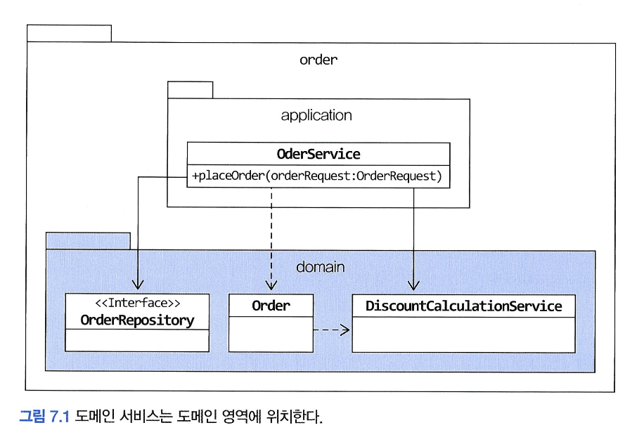
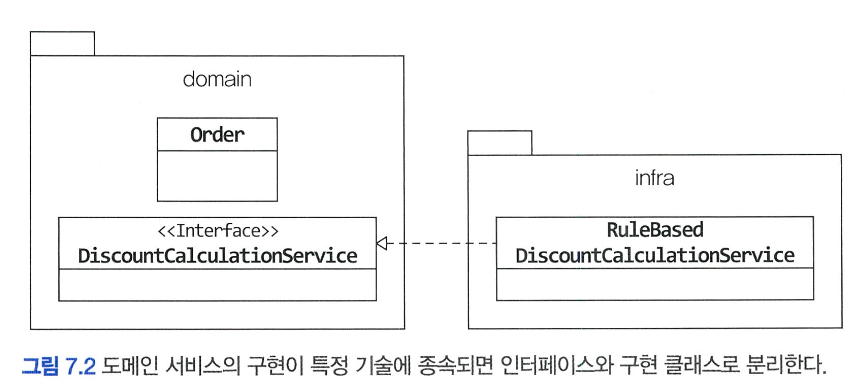

# 도메인 서비스

# 🌀 여러 애그리거트가 필요한 기능

- 도메인 로직을 구현하다 보면 **하나의 애그리거트로 처리할 수 없는 기능**이 등장함.
    - ex) 실제 결제 금액 계산
    
    → 상품, 주문, 쿠폰, 회원 애그리거트의 정보가 모두 필요함
    

| 필요 데이터 | 출처 (애그리거트) |
| --- | --- |
| 상품 가격, 배송비 | 상품 애그리거트 |
| 구매 수량 | 주문 애그리거트 |
| 쿠폰 할인 조건, 할인율 | 쿠폰 애그리거트 |
| 회원 등급 할인 | 회원 애그리거트 |

### 🍥 **문제점: 한 애그리거트에 책임 몰아넣기**

```java
public class Order {
    private List<Coupon> usedCoupons;
    private Orderer orderer;

    private Money calculatePayAmounts() {
        Money total = calculateTotalAmounts();
        //쿠폰별로 할인 금액을 구한다.
        Money couponDiscount = coupons.stream()
            .map(coupon -> calculateDiscount(coupon))
            .reduce(Money.ZERO, Money::add);
				//회원에 따른 추가 할인을 구한다.
        Money memberDiscount = calculateDiscount(orderer.getMember().getGrade());
				//실제 결제 금액 계산
        return total.minus(couponDiscount).minus(memberDiscount);
    }
}
```

- `Order` 애그리거트가 필요한 데이터를 모두 가지도록 한 뒤 할인 금액 계산 책임을 할당
- "2% 추가 할인" 같은 **글로벌 정책** 등장 → `Order` 애그리거트의 코드 수정 필요
- → **주문 애그리거트가 본인 책임이 아닌 로직까지 담당**하게 됨

### 🍥 해결책**: 도메인 서비스로 분리해야 한다**

- 여러 애그리거트의 데이터를 조합해야 하는 기능은 특정 애그리거트가 책임지면 **응집도가 떨어지고 변경에 취약해짐**.
- 게다가 애그리거트의 범위를 넘어서는 도메인 개념이 애그리거트에 숨어들어 명시적으로 드러나지 않게 됨.
- —> 도메인 기능을 별도 서비스로 구현하는 것이 해결책!

# 🌀 도메인 서비스

## 🍥 도메인 서비스란?

- 도메인 서비스는 **도메인 로직**을 수행하지만,
    
    **엔티티나 밸류 객체로 표현하기 어려운 비즈니스 규칙**을 구현하는 객체
    
- 주로 **애그리거트에 넣기 애매한 도메인 로직**을 담당한다.
- 보통 다음 상황에서 도메인 서비스를 사용한다
    1. **계산 로직**
        - 여러 애그리거트를 기반으로 하는 복잡한 계산
        - 한 애그리거트에 넣기엔 부담스러운 도메인 로직
    2. **외부 시스템 연동이 필요한 도메인 로직**
    - 도메인 로직 자체는 중요하지만 구현 시 외부 시스템 호출이 필요한 경우
- 도메인 서비스는 도메인 계층에 위치
- 상태 없이 도메인 로직만 수행
    - 필요한 정보는 메서드 인자로 전달

## 🍥 계산 로직과 도메인 서비스

### 🍧 할인 금액 계산 도메인 서비스

```java
public class DiscountCalculationService {
    public Money calculateDiscountAmounts(
        List<OrderLine> orderLines,
        List<Coupon> coupons,
        MemberGrade grade
    ) {
        Money couponDiscount = coupons.stream()
            .map(this::calculateDiscount)
            .reduce(Money.ZERO, Money::add);

        Money membershipDiscount = calculateDiscount(grade);
        return couponDiscount.add(membershipDiscount);
    }

    private Money calculateDiscount(Coupon coupon) {
        // 쿠폰 조건에 따라 할인 계산
    }

    private Money calculateDiscount(MemberGrade grade) {
        // 등급에 따라 할인 계산
    }
}
```

### 🍧 도메인 서비스 사용 위치

1. **애그리거트 내부에서 사용** (서비스 객체를 파라미터로 전달)

```java
// Order.java
public void calculateAmounts(DiscountCalculationService svc, MemberGrade grade) {
    Money total = getTotalAmounts();
    Money discount = svc.calculateDiscountAmounts(this.orderLines, this.coupons, grade);
    this.paymentAmounts = total.minus(discount);
}
```

- 서비스 객체를 필드로 주입하지 않고 메서드 인자로 전달하는 것이 좋음

2. **응용 서비스 내부에서 사용**

```java
public class OrderService {
	private DiscountCalculationService discountCalculationService;
	
	...
	
	public Order createOrder(...) {
    Order order = new Order(...);
    order.calculateAmounts(discountCalculationService, member.getGrade());
    return order;
	}
	...
}
```

⚠️ 도메인 서비스 객체를 **애그리거트에 의존 주입하지 말자**

- `@Autowired`로 애그리거트에 주입하지 말자!
    - 서비스는 상태가 없고, 일부 기능에서만 필요.
    - 애그리거트는 **데이터와 행위가 결합된 개념**. 서비스 객체는 데이터와 무관.
    - 기술적 편의를 위해 도메인 모델을 훼손하게 됨.
    
    **—> 필요한 메서드에서만 파라미터로 전달하자**
    

- 반대로 도메인 서비스의 기능을 실행할 때 애그리거트를 전달하는 것도 가능
- 계좌 이체처럼 **2개의 애그리거트가 함께 변경되는 경우**, 도메인 서비스로 구현

```java
public class TransferService {
    public void transfer(Account from, Account to, Money amount) {
        from.withdraw(amount);
        to.credit(amount);
    }
}
```

### 🍧 도메인 서비스 vs 응용 서비스

| 구분 | 도메인 서비스 | 응용 서비스 |
| --- | --- | --- |
| 관심사 | 도메인 규칙(비즈니스 로직) | 유스케이스/흐름 관리 |
| 상태 | 없음 (stateless) | 있음 (필요에 따라 존재) |
| 기능 | 할인 계산, 이체 로직, 권한 체크 등 | 주문 생성, 이체 요청, 결제 처리 등 |
| 위치 | 도메인 계층 | 애플리케이션 계층 |
| 트랜잭션 처리 | ❌ 하지 않음 | ✅ 트랜잭션 시작/커밋/롤백 포함 |

### 🍧 도메인 서비스인지 판단하는 기준

아래 조건 중 **하나라도 해당**하면 도메인 서비스로 분리:

- 애그리거트의 **상태 값을 계산**한다.
- 애그리거트의 **상태를 변경**한다.
- 하지만 **단일 애그리거트에 넣기 어렵다.**

> 도메인 로직이 맞지만 구조상 엔티티에 넣기 애매 → 도메인 서비스!
> 

## 🍥 외부 시스템 연동과 도메인 서비스

- 외부 시스템과 도메인 서비스가 연동 기능을 담당할 수도 있다.
- 예를 들어 설문조사 시스템과 사용자 역할 관리 시스템이 분리되어 있을 때, 설문조사 시스템은 설문 생성 권한을 확인하기 위해 역할 관리 시스템과 연동해야 한다.
- 시스템 간 연동은 주로 HTTP API 호출로 이루어진다.
- 하지만 설문조사 도메인 입장에서는 ‘사용자가 설문 생성 권한을 가졌는지’ 확인하는 도메인 로직으로 볼 수 있다.
- 이 도메인 로직은 다음과 같은 **도메인 서비스 인터페이스**로 표현한다.

```java
//도메인 인터페이스
public interface SurveyPermissionChecker {
    boolean hasUserCreationPermission(String userId);
}
```

- 응용 서비스는 이 도메인 서비스를 통해 생성 권한을 검증한다.

```java
public class CreateSurveyService {
    private SurveyPermissionChecker permissionChecker;

    public Long createSurvey(CreateSurveyRequest req) {
        validate(req);
        // 도메인 서비스를 이용해 외부 시스템 연동을 표현
        if (!permissionChecker.hasUserCreationPermission(req.getRequestorId())) {
            throw new NoPermissionException();
        }
        ...
    }
}
```

## 🍥 도메인 서비스의 패키지 위치

- 도메인 서비스는 도메인 로직을 표현하므로 도**메인 계층의 같은 패키지나 하위 패키지에 위치**
- 도메인 서비스가 많거나 엔티티, 밸류 객체 등과 명확히 구분하고 싶다면, `domain.service`, `domain.repository` 등 하위 패키지로 구분 가능



## 🍥 도메인 서비스의 인터페이스와 클래스

- 외부 연동, 룰 엔진, 기술 종속성 등으로 인해 구현이 바뀔 수 있는 경우
    - 도메인 서비스는 인터페이스로 선언
    - 구현체는 `infra` 영역에 둠
    - 구현 기술에 의존하는 부분을 인터페이스로 추상화하면
        - 도메인 영역이 특정 구현에 종속되지 않고
        - 도메인에 대한 테스트가 쉬워짐

```java
// domain
public interface DiscountCalculationService { ... }

// infra
public class RuleBasedDiscountCalculationService implements DiscountCalculationService { ... }
```

