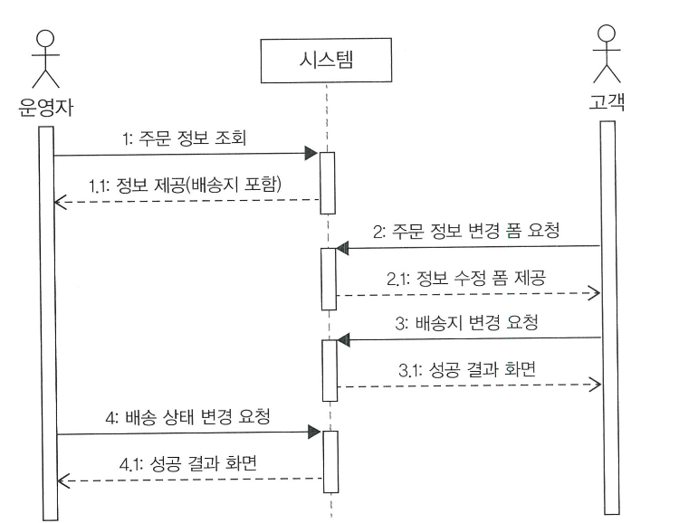
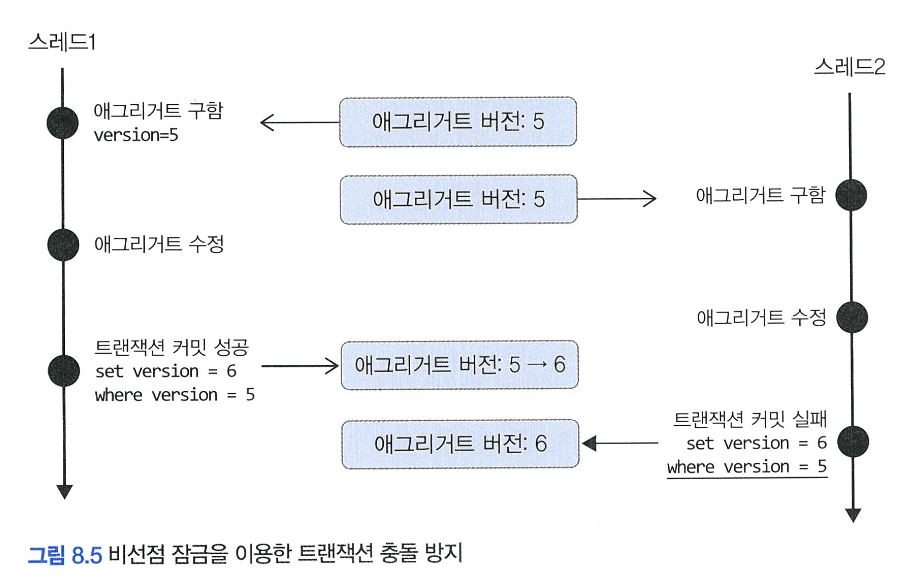
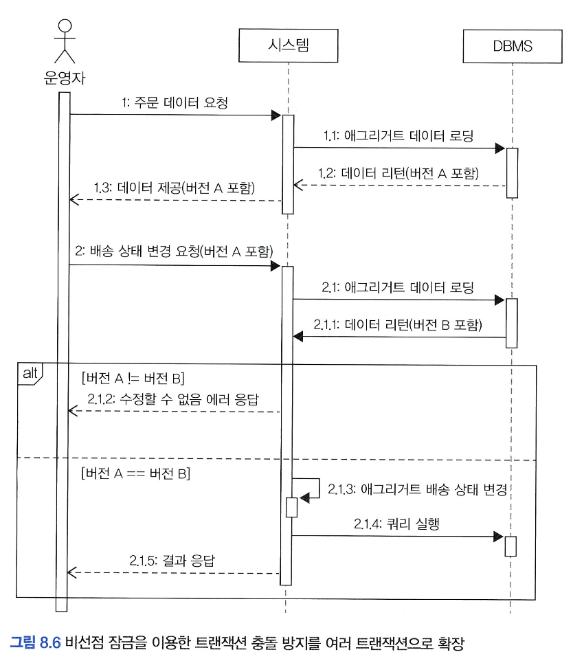
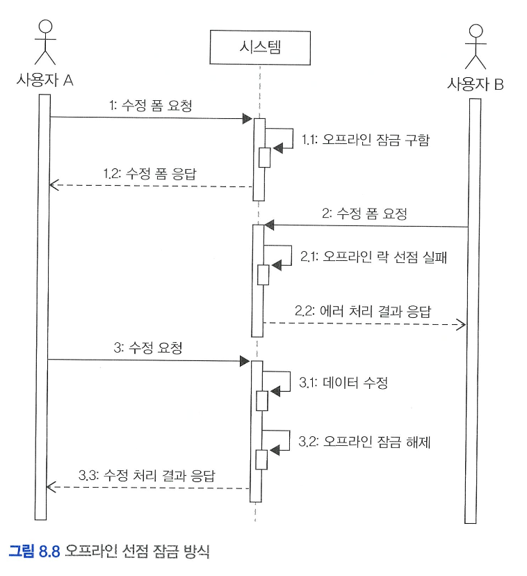
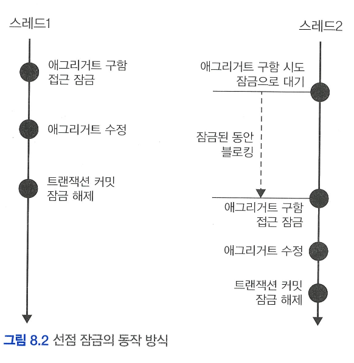

# 8️⃣ 애그리거트 트랜잭션 관리

# 🌀 애그리거트의 트랜잭션

## 🍥 애그리거트와 트랜잭션

**📌 문제 상황**

같은 **주문 애그리거트(Order Aggregate)** 에 대해,

- **운영자**는 "배송 상태 변경"
- **고객**은 "배송지 정보 변경"
    
    을 동시에 요청하는 경우
    

이 경우 각각의 스레드는 **다른 인스턴스**의 주문 애그리거트를 가져와 트랜잭션을 수행하게 된다.

→ 즉, 개념적으로는 같은 주문이지만 실제로는 서로 **다른 객체**를 사용하게 된다.

**⚠️ 발생할 수 있는 문제**

- 운영자가 **기존 배송지** 기준으로 배송 상태를 '배송 중'으로 변경했지만,
- 그 사이 고객이 **배송지 정보**를 변경했다면?

→ **일관성 없는 상태가 DB에 저장**되는 문제 발생!

**해결 방법** 

1. **선점 잠금(Pessimistic Lock)**
    - 운영자가 주문 애그리거트를 조회하고 수정하는 동안
        
        → 고객이 해당 애그리거트를 수정하지 못하도록 **잠금**을 건다.
        
    - 즉, 먼저 잡은 쪽만 쓰기를 허용.
2. **비선점 잠금(Optimistic Lock)**
    - 동시 수정을 허용하지만,
    - 커밋 시점에 **버전 정보를 비교**해 충돌 여부를 판단하고 충돌 시 에러를 던짐.
    - → 수정 전 애그리거트를 **다시 조회**해 최신 상태 반영 후 다시 처리해야 함.

# 🌀 애그리거트 잠금 기법

## 🍥 선점 잠금 **(Pessimistic Lock)**

- **한 스레드(또는 트랜잭션)** 가 애그리거트를 사용하는 동안,
- **다른 스레드**가 **같은 애그리거트에 접근하지 못하도록 막는 방식이다.**
- → 즉, 먼저 잠근 쪽이 **완료할 때까지 나머지는 대기(Blocking)** 한다.



### 🍧 동작 방식

1. **스레드 1**이 애그리거트를 선점 잠금으로 조회
2. **스레드 2**가 동일한 애그리거트를 조회하려 하면, **잠금이 해제될 때까지 대기**
3. 스레드 1이 수정을 마치고 **트랜잭션 커밋**, **잠금 해제**
4. 이제야 **스레드 2가 애그리거트를 조회하고 수정 가능**

### 🍧 실전 예 (배송 상태 & 배송지 충돌 방지)

- 운영자 스레드가 주문의 **배송 상태를 '배송 중'**으로 바꾸는 동안
- 고객 스레드는 같은 주문의 **배송지 주소를 바꾸려고 시도**
    - 선점 잠금 덕분에:
        - 고객 스레드는 대기하다가,
        - 배송 상태가 이미 "배송 중"으로 바뀐 후 조회되므로
        - "배송지 변경 불가" 에러가 발생하고 트랜잭션이 실패
            
            → **데이터 정합성 유지**
            

### 🍧 구현 방법

- 보통 DBMS가 제공하는 행단위 잠금을 사용해서 구현함

**1. JPA 직접 사용**

```java
Order order = entityManager.find(
    Order.class, orderNo, **LockModeType.PESSIMISTIC_WRITE**);
```

**2. Spring Data JPA**

```java
**@Lock(LockModeType.PESSIMISTIC_WRITE)**
@Query("SELECT m FROM Member m WHERE m.id = :id")
Optional<Member> findByIdForUpdate(@Param("id") MemberId memberId);

```

### 🍧 교착 상태 (Deadlock)

1. 스레드 1: A 애그리거트 잠금
2. 스레드 2: B 애그리거트 잠금
3. 스레드 1: B 잠금 시도 → 대기
4. 스레드 2: A 잠금 시도 → 대기
    
    → 서로 기다리며 **영원히 끝나지 않는 상태**, 즉 **Deadlock** 발생
    

**✅ 해결 방법**

- 잠금 대기 **최대 시간 설정 (힌트 사용)**

```java
Map<String, Object> hints = new HashMap<>();
hints.put("javax.persistence.lock.timeout", 2000); // 밀리초 단위로 지정, 지정한 시간 이내에 잠금을 구하지 못하면 익셉션을 발생 시킴
entityManager.find(Order.class, orderNo, LockModeType.PESSIMISTIC_WRITE, hints);

```

또는 Spring Data JPA에서:

```java
@QueryHints({
    @QueryHint(name = "javax.persistence.lock.timeout", value = "2000")
})

```

> 💡 하지만 DBMS마다 지원 여부가 다르므로 꼭 DB별 문서 확인 필요
> 
- **MySQL** 에서의 JPA의 선점 잠금 **처리**
    
    ## MySQL + JPA + 선점 잠금(Pessimistic Lock)
    
    ### 🔒 기본 동작 방식
    
    MySQL은 `SELECT ... FOR UPDATE` 구문으로 **행 단위 잠금(row-level locking)** 을 건다.
    
    → `JPA`에서 `PESSIMISTIC_WRITE` 잠금을 걸면, 내부적으로 **이 쿼리를 생성**해서 동작
    
    ```sql
    SELECT * FROM orders WHERE order_no = ? FOR UPDATE
    ```
    
    이때, **다른 트랜잭션이 이미 이 row를 잠금 중이라면** 대기하게 된다.
    
    ### ⏳ 대기 시간 처리 방식 (Lock Timeout)
    
    **✅ 기본 설정 (MySQL 기준)**
    
    - MySQL의 기본 락 대기 시간은 **`innodb_lock_wait_timeout`** 시스템 변수로 설정되어 있음.
    - 기본값은 **50초** (즉, 최대 50초까지 기다림)
    
    ```bash
    SHOW VARIABLES LIKE 'innodb_lock_wait_timeout';
    -- 결과: innodb_lock_wait_timeout | 50
    ```
    
    → 즉, 아무 설정 안 해도 **최대 50초까지 기다리고, 그 이후엔 에러(1205 Lock wait timeout exceeded) 발생**
    
    ### 🎯 JPA에서 대기 시간 지정 방법
    
    JPA는 내부적으로 `javax.persistence.lock.timeout` 힌트를 사용해서 대기 시간을 조절 가능
    
    하지만, 
    
    > ⚠️ MySQL은 javax.persistence.lock.timeout 힌트를 무시함!
    > 
    
    즉, `entityManager.find()`에 힌트를 넣어도 MySQL에서는 반영되지 않는다
    
    ```java
    Map<String, Object> hints = new HashMap<>();
    hints.put("javax.persistence.lock.timeout", 2000); // 무시됨 (MySQL에선 적용 안 됨)
    ```
    
    ### 🤔 그럼 어떻게 대기 시간을 조절할 수 있을까?
    
    **MySQL에서는 `innodb_lock_wait_timeout` 설정값을 조정해야 함!**
    
    **1. 세션 단위로 변경 (트랜잭션 시작 전 설정 가능)**
    
    ```sql
    SET innodb_lock_wait_timeout = 5; -- 5초
    ```
    
    > 📌 트랜잭션마다 이걸 미리 실행해야 함
    > 
    
    **2. 애플리케이션 코드에서 설정하려면?**
    
    **JPA에서는 어렵고**, JDBC를 직접 이용해서 설정하거나,
    
    Spring에서 커넥션 풀 설정을 통해 SQL 실행 전 이 값을 지정해야 한다.
    
    예: Spring 설정에서 커넥션이 잡힐 때 `SET innodb_lock_wait_timeout=5`를 실행하게 하는 방식 등
    

## 🍥 비선점 잠금 (Optimistic Locking)

### 🍧 선점잠금 방식의 한계

- 선점 잠금은 트랜잭션이 데이터에 접근하기 전 잠금을 걸어 충돌을 방지하는 방식임.



- 그러나 위의 그림과 같이, 운영자가 주문 정보를 조회한 뒤, 고객이 배송지를 변경하면 운영자는 변경 전 배송지 정보를 사용해서 배송 상태 변경 요청을 할 수 있음.
- 이러한 경우 고객이 변경한 배송지와 운영자가 사용하는 배송지 정보가 달라서 재고와 주문 처리에 충돌이 발생할 수 있음.
- 선전잠금은 트랜잭션 충돌을 해결하지 못함.

### 🍧 비선점잠금 방식

- 동시 접근을 막지 않고, 최종 변경 시점에 버전 정보를 비교해 충돌 여부를 판단하는 방식임.
- 데이터 변경 시점에 버전 번호를 조건으로 **UPDATE** 쿼리를 실행하여, 버전이 다르면 변경 실패.
    
    ```sql
    UPDATE aggtable SET version = version + 1, colx = ?, coly = ?
    WHERE aggId = ? AND version = 현재버전
    ```
    
- 만약 이미 다른 사용자가 변경해 버전이 바뀌었다면 변경 실패가 발생.



### 🍧 JPA에서 비선점 잠금 사용법

- 엔티티에 `@Version` 애너테이션을 붙인 버전 필드를 추가.
- 매핑되는 테이블에는 버전 정보를 저장하는 칼럼 추가
- JPA는 변경 시점에 자동으로 버전 비교 쿼리를 실행해서 충돌 검사를 함.

```java
@Entity
@Table(name = "purchase_order")
@Access(AccessType.FIELD)
public class Order {
    @EmbeddedId
    private OrderNo number;

    @Version
    private long version;  // 비선점 잠금을 위한 버전 필드
}
```

### 🍧 서비스 레이어에서의 비선점 잠금 적용

- 서비스 메서드에 `@Transactional`을 붙여 트랜잭션 범위를 지정한다.
- 리포지터리에서 애그리거트(엔티티)를 조회하고, 필요한 비즈니스 로직을 수행한다.
- 트랜잭션 종료 시점에 JPA가 자동으로 비선점 잠금 쿼리를 실행한다.
- 만약 충돌 발생 시 `OptimisticLockingFailureException` 예외가 발생한다.

```java
public class ChangeShippingService {
    @Transactional
    public void changeShipping(ChangeShippingRequest changeReq) {
        Order order = orderRepository.findById(new OrderNo(changeReq.getNumber()));
        checkNoOrder(order);  
        order.changeShippingInfo(changeReq.getShippingInfo());  *// 엔티티 상태 변경// 트랜잭션 커밋 시점에 버전 체크 및 업데이트 진행*
    }
}
```

### 🍧 컨트롤러에서 충돌 예외 처리

- `OptimisticLockingFailureException`가 발생하면 충돌 상황임을 사용자에게 알려준다.
- 예외 처리 후 사용자에게 재시도를 유도하거나 적절한 메시지 노출 가능.

```java
@Controller
public class OrderController {
    private ChangeShippingService changeShippingService;

    @PostMapping("/changeShipping")
    public String changeShipping(ChangeShippingRequest changeReq) {
        try {
            changeShippingService.changeShipping(changeReq);
            return "changeShippingSuccess";
        } catch(OptimisticLockingFailureException ex) {
            *// 동일 주문에 대해 다른 곳에서 수정이 선행되어 트랜잭션 충돌 발생*
            return "changeShippingTxConflict";
        }
    }
}
```

### 🍧 비선점 잠금을 확장하여 사용자 화면과 연동하기



- 사용자가 변경 폼을 요청할 때 현재 애그리거트 버전을 함께 전달하고,
- 변경 시점에 사용자로부터 전달받은 버전과 DB 버전을 비교해 다르면 변경 실패 처리.
- 실패 시 `OptimisticLockingFailureException` 또는 `VersionConflictException`을 발생시켜,
- UI에서 충돌 안내 메시지를 보여주어 사용자가 재시도하도록 유도함.
- 사용자에게 보여주는 수정 폼에 현재 애그리거트 버전을 함께 포함해 전송
- ex) HTML 폼에 `<input type="hidden" name="version" value="..."/>` 같이 버전을 숨겨 전달.

```java
public class StartShippingService {
    @Transactional
    public void startShipping(StartShippingRequest req) {
        Order order = orderRepository.findById(new OrderNo(req.getOrderNumber()));
        checkOrder(order);
        if (!order.matchVersion(req.getVersion())) {
            throw new VersionConflictException("버전 충돌 발생");
        }
        order.startShipping();
    }
}
```

- `matchVersion(long version)` 메서드는 현재 엔티티의 버전과 넘어온 버전 일치 여부를 판단 —> 불일치 시 충돌로 간주하여 예외 발생.

### 🍧 충돌 예외 처리 및 구분

- 충돌 예외는 크게 두 가지가 있음

| 예외명 | 발생 시점／의미 |
| --- | --- |
| `OptimisticLockingFailureException` | 프레임워크가 트랜잭션 커밋 시점 버전 불일치 감지시 발생 (거의 동시 수정) |
| `VersionConflictException` | 애플리케이션 로직에서 버전 비교 후 명시적으로 충돌 처리시 발생 (먼저 수정 됨) |
- 두 예외를 구분해 처리하는 것도 가능하며, 구분이 필요 없으면 하나의 예외로 통일해도 무방하다.

### 🍧 강제 버전 증가

- 애그리거트(Aggregate) 내부에 루트 엔티티 외의 엔티티나 밸류 객체가 존재하는 경우, **루트가 아닌 엔티티의 값만 변경**되었을 때 문제가 발생함.
- JPA는 루트 엔티티의 필드가 변경되지 않으면 `@Version` 값(버전)을 증가시키지 않음.
- 그 결과, 실제로는 애그리거트의 상태가 바뀌었음에도 **버전 충돌을 감지하지 못하고 트랜잭션이 성공**하게 됨.

**해결 방법: `OPTIMISTIC_FORCE_INCREMENT` 사용**

- JPA는 강제로 버전 값을 증가시키는 LockModeType을 제공함.
- `LockModeType.OPTIMISTIC_FORCE_INCREMENT`를 사용하면, 해당 엔티티의 필드 변경 여부와 상관없이 **트랜잭션 종료 시점에 버전이 무조건 증가**함.
- 이를 통해 루트 외의 구성 요소(예: 컬렉션, 밸류 객체 등)가 변경되었을 때도 안전하게 비선점 잠금을 적용할 수 있음.

```java
entityManager.find(Order.class, id, LockModeType.OPTIMISTIC_FORCE_INCREMENT);
```

**Spring Data JPA에서 사용하는 방법**

- `@Lock` 어노테이션을 통해 위 잠금 모드를 간단히 설정할 수 있음.

```java
@Lock(LockModeType.OPTIMISTIC_FORCE_INCREMENT)
Optional<Order> findById(OrderNo id);
```

## 🍥 오프라인 선점 잠금

- 오프라인 선점 잠금은 **여러 트랜잭션에 걸쳐 동시 수정 충돌을 방지하기 위한 방법**이다.
- 기존의 선점 잠금(Pessimistic Lock)이 **하나의 트랜잭션 내에서만 유효**한 반면,
- 오프라인 선점 잠금은 **수정 폼 요청 시점부터 실제 수정 완료까지** 잠금을 유지한다.



1. 사용자 A가 수정 폼을 요청하면, 잠금을 선점함 (1차 트랜잭션)
2. 사용자 B가 같은 문서의 폼을 요청하면, 이미 잠금이 선점되어 있어 에러 화면 반환
3. 사용자 A가 수정 요청을 완료하면, 잠금을 해제함 (2차 트랜잭션)

**⚠️ 문제점: 잠금 미해제 상황**

- 사용자 A가 수정 요청을 끝내지 않고 프로그램을 종료할 경우, **잠금이 영구히 해제되지 않는 문제**가 발생함.
- 이로 인해 **다른 사용자는 영원히 해당 리소스를 수정할 수 없음**.

**✅ 해결 방법**

**1. 잠금 유효 시간 부여**

- 잠금에는 **만료 시간(타임아웃)**을 설정해야 함.
- 일정 시간이 지나면 시스템이 자동으로 잠금을 해제하도록 구성해야 함.

**2. 주기적 연장 요청 (갱신)**

- 예: JavaScript의 `setInterval`이나 `Ajax`를 활용하여, **수정 폼에서 1분마다 서버에 요청을 보내 잠금 시간을 갱신**함.
- 이를 통해 사용자가 여전히 수정 중임을 시스템에 알릴 수 있음.

**3. 잠금 해제 실패 대응**

- 만약 유효 시간 초과 후에 사용자 A가 저장 요청을 시도할 경우,
    - 이미 잠금이 해제된 상태이므로,
    - 저장 요청은 실패 처리되고 사용자에게 알림을 제공해야 함.

### 🍧 오프라인 선점 잠금을 위한 LockManager 인터페이스와 관련 클래스

오프라인 선점 잠금을 구현하기 위해서는 아래 **4가지 기능**이 필요

| 기능 | 설명 |
| --- | --- |
| `tryLock` | 잠금 시도 |
| `checkLock` | 잠금이 유효한지 확인 |
| `releaseLock` | 잠금 해제 |
| `extendLockExpiration` | 잠금 유효 시간 연장 |

**LockManager 인터페이스**

```java
public interface LockManager {
    LockId tryLock(String type, String id) throws LockException;
    void checkLock(LockId lockId) throws LockException;
    void releaseLock(LockId lockId) throws LockException;
    void extendLockExpiration(LockId lockId, long inc) throws LockException;
}
```

- `type`: 도메인 타입 (예: `"domain.Article"`)
- `id`: 객체 식별자 (예: `"10"`)
- `LockId`: 잠금을 식별하는 고유값 (잠금 해제나 연장 시 사용)

**LockId 클래스**

```java
public class LockId {
    private String value;

    public LockId(String value) {
        this.value = value;
    }

    public String getValue() {
        return value;
    }
}
```

- 잠금 객체를 식별하는 값
- `LockManager`가 반환하며, 이후 해제·확인·연장 등에 반드시 사용

### 수정 폼 요청 시 (Controller → Service)

```java
public DataAndLockId getDataWithLock(Long id) {
    LockId lockId = lockManager.tryLock("data", id); // ① 오프라인 잠금 시도
    Data data = someDao.select(id); // ② 데이터 조회
    return new DataAndLockId(data, lockId); // ③ 데이터와 잠금 ID 반환
}

```

```java
@RequestMapping("/some/edit/{id}")
public String editForm(@PathVariable("id") Long id, ModelMap model) {
    DataAndLockId dl = dataService.getDataWithLock(id);
    model.addAttribute("data", dl.getData());
    model.addAttribute("lockId", dl.getLockId()); // ④ lockId를 모델에 담아 뷰로 전달
    return "editForm";
}

```

```html
<!-- ⑤ lockId를 숨겨서 함께 전송 -->
<form th:action="@{/some/edit/{id}(id=${data.id})}" method="post">
    <input type="hidden" name="lid" th:value="${lockId.value}" />
    <!-- 기타 입력 폼 -->
</form>
```

---

### 수정 요청 시 (Controller → Service)

```java
public void edit(EditRequest editReq, LockId lockId) {
    lockManager.checkLock(lockId);         // ① 잠금 유효성 검사
    // ② 실제 수정 작업
    lockManager.releaseLock(lockId);       // ③ 작업 완료 후 잠금 해제
}

```

```java
@RequestMapping(value = "/some/edit/{id}", method = RequestMethod.POST)
public String edit(@PathVariable("id") Long id,
                   @ModelAttribute("editReq") EditRequest editReq,
                   @RequestParam("lid") String lockIdValue) {
    editReq.setId(id);
    someEditService.edit(editReq, new LockId(lockIdValue)); // ④ 전달받은 lockId 사용
    return "editSuccess";
}

```

**⚠️ 주의사항**

- `tryLock` 성공 시 `LockId`를 반드시 보관 (뷰에서 전송)
- 수정 시 `checkLock(lockId)` 호출로 잠금 유효성 반드시 확인
    - 잠금 유효 시간이 지났다면 → 다른 사용자가 이미 잠금을 선점했을 수 있음
    - 잠금을 선점하지 않은 사용자가 수정 요청을 보내면 → 예외 처리해야 함
- 작업 완료 후 `releaseLock(lockId)`를 호출해 잠금 해제 필수

### 🍧 DB를 이용한 LockManager 구현

- 오프라인 선점 잠금을 DB 테이블을 이용해 구현
- 동시 수정 방지를 위한 **선점 락(Pessimistic Offline Lock)** 적용
- `JdbcTemplate`을 활용한 구현
- 잠금 정보는 `locks` 테이블에 저장

### 1. `locks` 테이블 구조

```sql
CREATE TABLE locks (
    type VARCHAR(255),
    id VARCHAR(255),
    lockid VARCHAR(255),
    expiration_time DATETIME,
    PRIMARY KEY (type, id)
) CHARACTER SET utf8;

CREATE UNIQUE INDEX locks_idx ON locks (lockid);
```

### 설명

- `type`, `id`: 잠금 대상 식별자 (복합 PK)
- `lockid`: 고유 잠금 ID (`UUID` 등으로 생성, 유니크 인덱스 설정)
- `expiration_time`: 잠금 만료 시간

### 2. 예시 쿼리

```sql
-- 주문(Order) 타입의 ID 1에 대한 잠금 삽입
INSERT INTO locks VALUES ('Order', '1', 'Ms@tlockid', '2025-07-18 09:10:00');
```

### 3.  `LockData` 클래스

```java
public class LockData {
    private String type;
    private String id;
    private String lockId;
    private long expirationTime;

    public LockData(String type, String id, String lockId, long expirationTime) {
        this.type = type;
        this.id = id;
        this.lockId = lockId;
        this.expirationTime = expirationTime;
    }

    public String getType() { return type; }
    public String getId() { return id; }
    public String getLockId() { return lockId; }
    public long getExpirationTime() { return expirationTime; }

    public boolean isExpired() {
        return expirationTime < System.currentTimeMillis();
    }
}

```

### 4.  `SpringLockManager` 구현 (핵심 메서드 중심)

### 4.1 `tryLock`

```java
@Transactional(propagation = Propagation.REQUIRES_NEW)
@Override
public LockId tryLock(String type, String id) throws LockException {
    checkAlreadyLocked(type, id); // 기존 잠금 확인
    LockId lockId = new LockId(UUID.randomUUID().toString()); // 새 lockId 생성
    locking(type, id, lockId); // 잠금 수행
    return lockId;
}
```

- 기존에 유효한 잠금이 있으면 예외
- `UUID` 기반 새 잠금 ID 생성 후 테이블에 INSERT

### `checkAlreadyLocked`

```java
private void checkAlreadyLocked(String type, String id) {
    List<LockData> locks = jdbcTemplate.query(
        "SELECT * FROM locks WHERE type = ? AND id = ?",
        lockDataRowMapper, type, id
    );
    Optional<LockData> lockData = handleExpiration(locks);
    if (lockData.isPresent()) throw new AlreadyLockedException();
}
```

- 잠금이 존재하고 아직 만료되지 않았다면 예외 발생

### `handleExpiration`

```java
private Optional<LockData> handleExpiration(List<LockData> locks) {
    if (locks.isEmpty()) return Optional.empty();

    LockData lock = locks.get(0);
    if (lock.isExpired()) {
        jdbcTemplate.update(
            "DELETE FROM locks WHERE type = ? AND id = ?",
            lock.getType(), lock.getId()
        );
        return Optional.empty();
    } else {
        return Optional.of(lock);
    }
}
```

- 만료된 잠금은 삭제
- 유효한 잠금이면 `Optional`로 반환

### `locking`

```java
private void locking(String type, String id, LockId lockId) {
    try {
        int result = jdbcTemplate.update(
            "INSERT INTO locks VALUES (?, ?, ?, ?)",
            type, id, lockId.getValue(), new Timestamp(getExpirationTime())
        ); // 잠금을 위해 locks 테이블에 데이터 삽입
        if (result == 0) throw new LockingFailException();
    } catch (DuplicateKeyException e) {
        throw new LockingFailException(e);
    }
}
```

- `INSERT` 실패 → 동시성 충돌 → 예외 처리

### 5. `checkLock`

```java
@Transactional(propagation = Propagation.REQUIRES_NEW)
@Override
public void checkLock(LockId lockId) throws LockException {
    Optional<LockData> lockData = getLockData(lockId);
    if (!lockData.isPresent()) throw new NoLockException();
}
```

- 전달된 `lockId`로 유효한 잠금 존재 여부 확인

```java
private Optional<LockData> getLockData(LockId lockId) {
    List<LockData> locks = jdbcTemplate.query(
        "SELECT * FROM locks WHERE lockid = ?",
        lockDataRowMapper, lockId.getValue()
    );
    return handleExpiration(locks);
}
```

- 전달된  `lockId`로 해당하는 `LockData`를 구한다

### 6. `extendLockExpiration`

```java
@Transactional(propagation = Propagation.REQUIRES_NEW)
@Override
public void extendLockExpiration(LockId lockId, long inc) {
    Optional<LockData> lockDataOpt = getLockData(lockId);
    LockData lockData = lockDataOpt.orElseThrow(NoLockException::new);

    jdbcTemplate.update(
        "UPDATE locks SET expiration_time = ? WHERE type = ? AND id = ?",
        new Timestamp(lockData.getExpirationTime() + inc),
        lockData.getType(), lockData.getId()
    );
}
```

- 잠금 유효 시간 연장

### 7. `releaseLock`

```java
@Transactional(propagation = Propagation.REQUIRES_NEW)
@Override
public void releaseLock(LockId lockId) throws LockException {
    jdbcTemplate.update(
        "DELETE FROM locks WHERE lockid = ?", lockId.getValue()
    );
}
```

- 잠금 해제