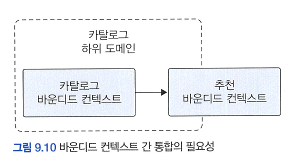

# 9️⃣ 도메인 모델과 바운디드 컨텍스트

# 🌀 바운디드 컨텍스트

- 현실의 도메인은 **여러 개의 하위 도메인**으로 나뉨.
- 모든 하위 도메인을 하나의 통합된 모델로 표현하려고 하면, 결국 **어느 쪽에도 적합하지 않은 애매한 모델**이 되어버림.
- ex) **‘상품’이라는 개념은 하위 도메인마다 의미가 다르다**
    
    
    | 도메인 | ‘상품’의 의미 |
    | --- | --- |
    | 카탈로그 | 상품 이름, 이미지, 설명, 가격 등 *마케팅 중심* 정보 |
    | 재고관리 | 상품의 실물 수량을 추적하는 *로지스틱 중심* 정보 |
    | 주문 | 주문 시 선택된 상품의 *주문 정보* |
    | 배송 | 배송 대상이 되는 *상품 패키지* 정보 |
- **ex) 같은 실체라도 도메인에 따라 이름이 달라진다**
    - 사용자를 지칭하는 용어도 도메인마다 다름
        - 회원 도메인: **회원**
        - 주문 도메인: **주문자**
        - 배송 도메인: **보내는 사람**
        
- 각 도메인마다 **고유한 용어, 요구사항, 의미 체계**가 다름
- 도메인 모델이 섞이면:
    - 모델의 의미가 모호해지고
    - 도메인별 요구사항을 제대로 반영하기 어려워짐

### 🍧 바운디드 컨텍스트

- **“의미가 일관된 용어와 모델이 적용되는 명확한 범위(경계)를 갖는 컨텍스트”**
- 즉, 하나의 도메인 모델이 **어디까지 유효한지를 명시적으로 나눈 경계**
- 같은 개념(예: 상품)도 서로 다른 바운디드 컨텍스트 안에서는 **다르게 정의되고 다르게 사용**될 수 있음

## 🍥 바운디드 컨텍스트

- 바운디드 컨텍스트는 **도메인 모델의 경계를 나누는 단위**
- **하나의 바운디드 컨텍스트는 하나의 도메인 모델을 포함**한다.
- 바운디드 컨텍스트는 **용어의 차이**를 기준으로 구분할 수 있다.
    - 예: "상품"이라는 용어가 ‘카탈로그’ 컨텍스트와 ‘재고’ 컨텍스트에서 의미가 다르므로, 이 기준으로 컨텍스트를 나눈다.
- 실제 시스템에서는 **하나의 바운디드 컨텍스트가 물리적인 시스템 단위**가 되기도 한다.
- 이상적으로는 하위 도메인과 바운디드 컨텍스트가 일대일 관계를 가지는 것이 바람직하지만, **현실에선 팀 조직 구조나 기술적 고려에 따라 다르게 나뉘기도 한다.**
    - 예: 하나의 "주문 하위 도메인" 안에서도, 주문을 처리하는 팀과 결제 금액을 계산하는 팀이 서로 다른 바운디드 컨텍스트를 가질 수 있다.
        
        
        
- 작은 조직에서는 여러 하위 도메인을 하나의 바운디드 컨텍스트로 구현하기도 한다
    - 예: 중소형 쇼핑몰 시스템에서는 회원, 카탈로그, 재고, 구매, 결제 도메인을 하나의 애플리케이션 안에 구현한다.
- 이 경우에도 **도메인 간 모델이 섞이지 않도록 명확하게 분리된 패키지 구조**로 관리하는 것이 중요하다.
    - 이렇게 하면 물리적으로는 하나의 컨텍스트지만 **논리적으로는 여러 바운디드 컨텍스트를 구현하는 효과**를 낼 수 있다.

      
        
- 바운디드 컨텍스트는 각 도메인 요구에 맞는 모델을 갖는다
    - 같은 개념(예: 사용자, 상품)이라도 바운디드 컨텍스트에 따라 서로 **다른 역할과 책임**을 갖는다.


| 바운디드 컨텍스트 | 모델 이름 | 역할 |
| --- | --- | --- |
| 회원 컨텍스트 | `Member` | Aggregation Root (회원 자체를 표현) |
| 주문 컨텍스트 | `Orderer` | Value Object (주문 시점의 회원 정보) |
| 카탈로그 컨텍스트 | `Product`, `Category` | 상품의 정보 및 카테고리 구조 |
| 재고 컨텍스트 | `Product` | 물리적 상품 재고, 카탈로그와 무관 |
- 한 프로젝트 안에 여러 하위 도메인이 공존할 경우에도, **각 도메인별로 패키지를 명확히 분리**하여 모델 간 경계를 유지해야 한다.
    - 이를 통해 도메인 요구사항의 변경이 서로에게 영향을 미치지 않도록 방지할 수 있다.

## 🍥 바운디드 컨텍스트 구현

- 1.  바운디드 컨텍스트는 도메인 모델만 포함하지 않는다
- 바운디드 컨텍스트는 도메인 모델뿐 아니라 **전체 애플리케이션을 구성하는 모든 계층**을 포함한다.

  
    
    - **즉, 컨텍스트는 기능 단위로 완결된 하나의 시스템 단위**이다.

- 2.  모든 컨텍스트가 반드시 DDD 방식(도메인 주도 모델링)을 사용할 필요는 없다.
- 단순한 기능(예: 리뷰, 로그 등)은 **CRUD 방식(Service + DAO 구조)**으로도 충분하다.
    - 도메인 로직이 단순한 경우에는 복잡한 DDD 패턴보다 유지보수가 더 쉽다.


- 3. 같은 바운디드 컨텍스트 안에서도 CQRS 패턴처럼 구현 전략을 혼합할 수 있다
- **CQRS (Command Query Responsibility Segregation)**: 명령과 조회를 분리하는 패턴
- 상태 변경은 도메인 모델 기반으로, 조회는 DAO 기반의 단순 쿼리 모델로 구현할 수 있다.

  
    

- 4.  컨텍스트마다 다른 기술 스택을 쓸 수도 있다
- 각각의 바운디드 컨텍스트는 독립성이 보장되므로, **각자 다른 기술과 프레임워크를 사용할 수 있다**.
    - 컨텍스트 A: Spring MVC + JPA
    - 컨텍스트 B: Netty + MyBatis
    - 컨텍스트 C: MongoDB(NoSQL)
- 기술 독립성은 시스템의 유연성과 확장성을 높여준다.

- 5.  바운디드 컨텍스트는 UI가 없어도 된다
- UI 없이도 REST API 등으로 다른 시스템에 기능을 제공하는 것이 가능하다.
- 또는 UI 서버가 여러 바운디드 컨텍스트에서 데이터를 모아 사용자에게 응답할 수도 있다.
1. **브라우저가 직접 여러 바운디드 컨텍스트에 요청하는 방식**
    - HTML: 카탈로그 컨텍스트
    - AJAX: 리뷰 컨텍스트

      
        
2. **UI 서버를 통한 간접 통신 방식**
    - 브라우저 → UI 서버 → 각 컨텍스트 (파사드 역할)
    - UI 서버는 여러 컨텍스트로부터 데이터를 수집하고 브라우저에 통합 응답을 제공

      
        

# 🌀 바운디드 컨텍스트 간 통합과 관계

## 🍥 바운디드 컨텍스트 간 통합

- 기존 **카탈로그 시스템**을 개발하던 팀과 별개로, **추천 시스템**을 전담하는 새로운 팀이 구성됨.
- 이로 인해, **카탈로그 하위 도메인** 내에 두 개의 **바운디드 컨텍스트**(카탈로그, 추천)가 생김.


### 🍧 바운디드 컨텍스트 간 통합이 필요한 이유

- 사용자 상품 상세 페이지에서 **추천 상품 목록**을 함께 보여주기 위해
- 카탈로그는 상품 정보를 사용자에게 보여주고
- 추천 시스템은 **itemId, rank** 등의 정보를 리턴함 → 도메인 모델이 다름

### 🍧 REST API를 통한 직접 통합

### 구조

- 카탈로그 도메인 서비스: `ProductRecommendationService`
- 구현체: `RecSystemClient` (Infra Layer)
    - 추천 API 호출
    - 추천 시스템 모델(RecommendationItem)을 카탈로그 도메인 모델(Product)로 변환
    - 내부에 `toProducts`, `toProductId` 등의 메서드


### 모델 간 변환 처리

- API 응답은 `itemId`, `rank` 등으로 구성되어 있음
- 카탈로그 모델로 변환 필요
- 변환 로직이 복잡하면 `Translator` 클래스를 따로 만들어 처리


### 🍧 메시지 큐를 이용한 간접 통합 (비동기)

### 메시지 큐를 활용한 통합

- 추천 시스템은 **사용자 활동 이력** (조회, 구매 등)을 필요로 함
- 카탈로그 시스템이 메시지를 큐에 발행
- 추천 시스템은 큐에서 메시지를 소비하여 자체 DB나 캐시에 저장 후 추천 계산에 활용


### 예시 메시지

- 카탈로그 관점: `ViewLog`, `OrderLog` 등

  
    
- 추천 관점: `ActivityLog`

  
    

- **큐를 누가 관리하는가**에 따라 메시지 구조가 달라짐
    - 카탈로그가 큐를 관리: 카탈로그 도메인 모델에 맞춰 메시지를 구성
    - 추천 시스템이 큐를 관리: 추천 도메인 모델에 맞춰 메시지를 구성

### 1. 카탈로그 기준 메시지 발행

```java
public class ViewLogService {
    private MessageClient messageClient;

    public void appendViewLog(String memberId, String productId, Date time) {
        messageClient.send(new ViewLog(memberId, productId, time));
    }
}
```

- 메시지 모델: `ViewLog`
- 큐에 그대로 전송
- 추천 쪽에서 ViewLog → ActivityLog로 변환

### 2. 추천 기준 메시지 발행

```java
public class ViewLogService {
    private MessageClient messageClient;

    public void appendViewLog(String memberId, String productId, Date time) {
        messageClient.send(new ActivityLog(productId, memberId, ActivityType.VIEW, time));
    }
}
```

- 메시지 모델: `ActivityLog`
- 카탈로그 쪽에서 도메인 모델을 맞춰서 생성

### 🍧 메시징 연동 방식: Publisher / Subscriber(출판/구독) 모델

- 카탈로그가 메시지를 **Publish**
- 추천 시스템은 **Subscribe**
- 한 큐를 여러 컨텍스트(B, C 등)가 구독할 수도 있음


## 🍥 바운디드 컨텍스트 간 통합 전략

| 항목 | REST API 통합 | 메시지 큐 통합 |
| --- | --- | --- |
| 방식 | 동기 요청/응답 | 비동기 메시지 |
| 예시 | 추천 시스템에서 추천 상품 조회 | 사용자 활동 이력을 큐로 전달 |
| 데이터 흐름 | 요청 시점에 실시간으로 전달 | 이벤트 발생 시 큐에 기록 후 지연 전달 |
| 의존성 | 요청/응답 API 정의 필요 | 메시지 포맷 협의 필요 |
| 장점 | 즉시 응답, 실시간 추천 | 시스템 간 결합도 낮음, 탄력성 높음 |
| 단점 | 높은 결합도 | 메시지 설계 복잡도 증가 |

## 🍥 바운디드 컨텍스트 간 관계

- 바운디드 컨텍스트는 어떤 식으로든 연결되기 때문에 두 바운디드 컨텍스트는 다양한 방식으로 관계를 맺는다

### 🍧 고객/공급자 관계 (Customer / Supplier)


- **가장 흔한 관계**
    
    한 컨텍스트가 API(보통 REST)를 제공하고, 다른 컨텍스트가 이를 호출해 사용하는 구조
    
- **예시**
    - `추천 바운디드 컨텍스트`가 REST API를 제공
    - `카탈로그 바운디드 컨텍스트`가 해당 API를 호출하여 추천 상품을 표시
- **의존성 주의**
    - API 제공자가 인터페이스를 변경하면, 사용하는 쪽도 수정해야 함
    - 개발 일정에 상호 영향을 주므로 **협업 및 소통**이 중요
- **해결 방법**
    - API 제공자는 **일관성 있는 서비스**를 제공 (Open Host Service)
    - 사용하는 측은 도메인 모델 보호를 위해 **Anti-Corruption Layer (ACL)** 사용

### 🍧 공개 호스트 서비스 (Open Host Service)


- **정의**
    - 여러 클라이언트(다른 바운디드 컨텍스트)에서 사용 가능한 **표준화된 API**를 제공하는 서비스
- **예시**
    - 검색 시스템 (공급자) → 블로그, 게시판, 카페 등 다양한 소비자에게 검색 기능을 제공
- **장점**
    - 일관성 있고 재사용 가능한 API 설계 가능
    - 공급자(상류 컴포넌트)는 다양한 수요자의 요구를 하나의 서비스로 통합

### 🍧 안티 코럽션 계층 (Anti-Corruption Layer, ACL)

- **정의**
    - 외부 시스템의 도메인 모델이 내부 도메인 모델을 **침범하지 않도록 보호하는 계층**
- **예시**

  
    
- **역할**
    - 외부 모델 → 내부 모델로 안전하게 변환
    - 도메인 모델을 외부의 변경으로부터 보호

---

### 🍧 공유 커널 (Shared Kernel)

- **정의**
    - 둘 이상의 팀이 공동으로 **관리하는 모델(코드, 클래스 등)**을 공유함
- **예시**
    - 주문 도메인을 고객 서비스팀과 운영 툴팀이 공유
- **장점**
    - 중복 설계 방지
    - 모델 일관성 유지
- **단점**
    - 두 팀 간 **긴밀한 협력** 필요
    - 임의 변경 금지 → 관리가 어렵고, 협업이 필수

### 🍧 독립 방식 (Separate Ways)

- **정의**
    - 두 바운디드 컨텍스트를 **통합하지 않고 독립적으로** 운영
- **예시**
    - 쇼핑몰 시스템과 외부 ERP 시스템 간 통합이 없을 경우
    - 쇼핑몰 운영자가 수동으로 ERP에 판매 정보를 입력

  
    
- **특징**
    - 단순하지만 확장성에 한계 있음
    - 규모가 커지면 별도의 통합 시스템이 필요해질 수 있음

  
    

### 🍧 바운디드 컨텍스트 통합 방식 요약

| 관계 유형 | 특징 | 예시 |
| --- | --- | --- |
| 고객/공급자 | 한쪽이 API 제공, 한쪽이 소비. 강한 의존성 | 추천 시스템 API를 카탈로그에서 호출 |
| 공개 호스트 서비스 | 여러 소비자를 위한 공개 API 제공 | 검색 시스템 → 블로그, 카페 등 |
| 안티 코럽션 계층 | 외부 모델 침투 방지, 내부 모델 보호 | 외부 API 응답 → 내부 모델 변환 |
| 공유 커널 | 모델을 공유하지만 협력 필요, 임의 수정 금지 | 주문 모델 공유 |
| 독립 방식 | 통합 없이 별도로 운영, 수동 처리 | 쇼핑몰 → ERP 시스템 수동 입력 |

## 🍥 컨텍스트 맵

### 🍧 컨텍스트 맵이란?

- **바운디드 컨텍스트(Bounded Context) 간의 관계**를 시각적으로 표현한 지도.
- 복잡한 시스템을 **도메인 관점에서 전체적으로 조망**할 수 있게 도와주는 도구.
- **“나무만 보고 숲을 못 보는 상황”을 피하기 위한 수단.**

  
    

### 🍧 컨텍스트 맵의 주요 목적

1. **시스템 전체 구조 이해**
    
    → 각 바운디드 컨텍스트가 어디서부터 어디까지인지, 어떻게 연결되어 있는지 파악 가능.
    
2. **컨텍스트 경계 확인 및 조정**
    
    → 실제 하위 도메인과 일치하지 않는 바운디드 컨텍스트가 있다면 이를 조정할 수 있음.
    
3. **핵심 도메인에 조직 역량 집중 유도**
    
    → 조직이 어느 컨텍스트에 집중할지 전략적 판단 가능.
    
4. **모델 관계 시각화**
    
    → 주요 애그리거트를 함께 표시하면 각 컨텍스트가 어떤 도메인 모델을 중심으로 구성되었는지 명확해짐.
    

### 🍧 표현 방법

- 정해진 규칙은 없음.
    
    → 도형과 선 등 간단한 도구로 구성 가능.
    
    → 화이트보드, 파워포인트 등으로 쉽게 작성.
    
- 그림과 같이 OHS, Logistics, Review 등의 바운디드 컨텍스트들이 등장하고, 그들 간 연결관계가 단순한 선으로 표현됨.
- **그러나 정적인 문서가 아님.**
    
    → 시간이 지나거나 시스템 이해도가 깊어지면 **관계가 바뀌고**, 이에 따라 **컨텍스트 맵도 진화**해야 함.